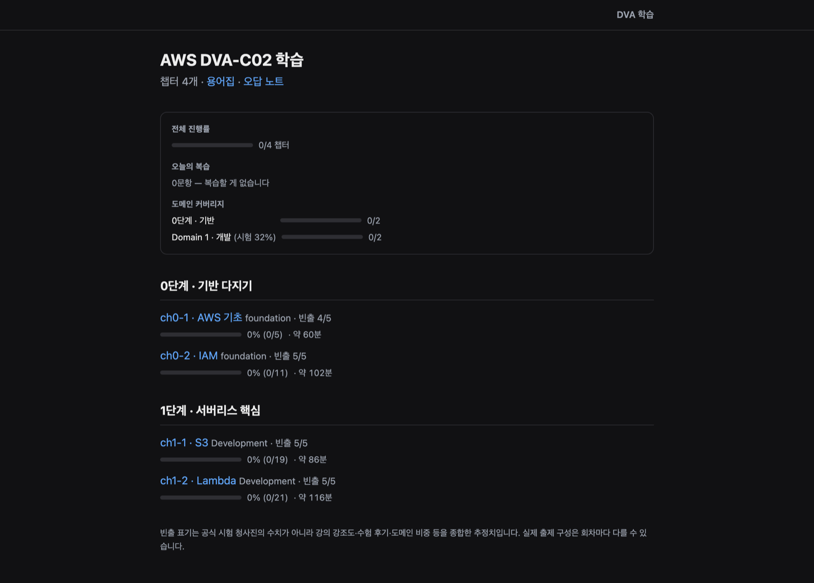
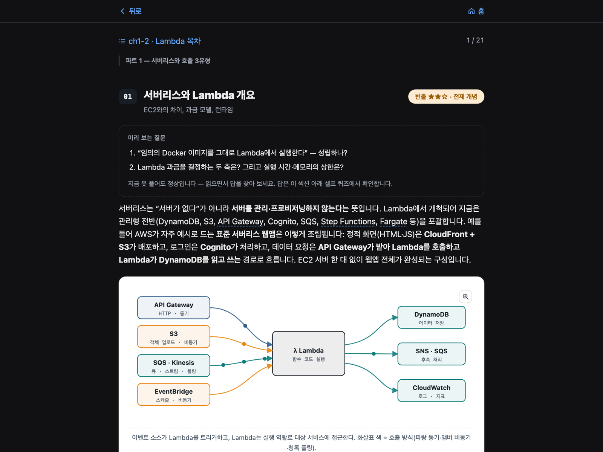

# aws-reps — AWS DVA-C02 학습 사이트

AWS Certified Developer – Associate(DVA-C02) 시험을 **한국어로, 읽기가 아니라 인출(retrieval)로** 준비하는 정적 학습 사이트. 개인 프로젝트다.

**▶ 라이브: <https://aws-reps.vercel.app>**

`Next.js(App Router)` · `React` · `TypeScript(strict)` · `MDX` — 서버 런타임 없음, 로그인 없음, 의존성 최소



---

## MVP 범위 — 4챕터에서 v1을 닫았다

이 사이트가 공개하는 챕터는 **4개**다. `ch0-1 AWS 기초` · `ch0-2 IAM` · `ch1-1 S3` · `ch1-2 Lambda`.

설계된 커리큘럼([`docs/CURRICULUM.md`](docs/CURRICULUM.md))은 24챕터짜리 트리이고, 나머지 20챕터는 원본 초안 상태로 리포에 남아 있다. **그걸 다 채우는 대신 4챕터에서 v1의 범위를 확정했다.**

의도적인 선택이다. 이 프로젝트에서 검증하고 싶었던 것은 "챕터를 몇 개 쓸 수 있나"가 아니라 **한 챕터를 끝까지 제대로 만드는 구조가 서는가**였다 — 콘텐츠 규약, 검증기, 학습 장치, 진도·복습 저장소, 배포 파이프라인. 그 구조는 4챕터로 전부 돌려볼 수 있고, 실제로 4챕터에 다 적용돼 있다. 챕터 5번째부터는 같은 파이프라인의 반복이지 새로운 문제가 아니다.

그래서 **양을 늘리는 대신 범위를 못 박고 v1을 닫았다.** 이 README가 그 선언이다.

---

## 학습 설계 — "읽었다"와 "안다"를 구분한다

기술 문서를 눈으로 훑으면 안다는 착각이 남는다. 그래서 한 섹션을 읽는 동안 **답을 떠올려야 넘어가는 지점**을 네 군데 심었다.



| 장치 | 언제 | 무엇을 노리나 |
|---|---|---|
| **미리 보는 질문** | 섹션 본문 **앞** | 답을 모르는 채로 질문을 먼저 읽게 해 본문을 "답 찾기"로 바꾼다 |
| **인출 카드** | 섹션 본문 **뒤** | 방금 읽은 개념을 보지 않고 말로 꺼내 본다 |
| **셀프 퀴즈** | 섹션 끝 | 미리 보는 질문의 답을 여기서 맞춰 본다 |
| **챕터 퀴즈** | 챕터 끝 | 채점되는 확인 문항 |
| **오답 노트** | 상시 | 틀린 문항을 **Leitner 3상자**로 굴린다. 복습 큐는 기한이 된 것만 내고, 별도의 **자유 연습 모드**로 졸업한 문항까지 범위를 골라 더 풀 수 있다 |

콘텐츠 쪽에도 규칙을 하나 뒀다 — **학습자가 답할 수 없는 것은 묻지 않는다.** 이 사이트의 독자는 "개발자지만 AWS는 처음이고 AWS 시험도 처음"인 사람이라, "이게 시험에 어떤 함정으로 나오나?" 같은 물음은 인출이 아니라 이탈을 만든다. 시험 메타지식은 **묻지 않고 알려주는 쪽**(모범 답변·해설)에 얹는다.

---

## 기술 선택과 그 근거

| 선택 | 왜 |
|---|---|
| **정적 사이트 (`output: "export"`)** | 서버 런타임이 없다. 어디에나 정적 파일로 올라가고 운영 비용이 0에 수렴한다. 학습앱에 필요한 상태(진도·오답)는 기기에 두면 충분해서, 서버를 두는 순간 생기는 인증·DB·비용을 통째로 회피했다 |
| **상태는 `localStorage`뿐, 로그인 없음** | 첫 화면에서 바로 공부를 시작할 수 있다. 회원가입은 학습앱에서 가장 큰 이탈 지점이고, 기기 간 동기화는 v1에 필요한 기능이 아니었다 |
| **콘텐츠 ↔ 앱 분리** | 앱(`app/`)은 셸이고 학습 내용은 `content/`의 챕터 모듈이다. 통로는 `lib/content.ts` 하나. 앱은 본문의 내부 표현을 모른 채 규약이 내보내는 것만 소비한다 |
| **콘텐츠 규약 + 검증기** | 챕터가 지켜야 할 계약을 [`content/schema.ts`](content/schema.ts)에 정본으로 두고, [`scripts/validate-content.ts`](scripts/validate-content.ts)(약 950줄, 검사 코드 60여 종)가 **빌드 전에** 값 수준까지 막는다. 챕터가 늘어도 앱이 조용히 깨지지 않는 유일한 방법이었다 |
| **문서의 "사실 층"은 자동 생성** | `docs/ARCHITECTURE.md`의 챕터 인벤토리·스택 버전은 손으로 안 쓴다. `scripts/gen-arch-facts.ts`가 코드에서 뽑고 `--check`가 **CI 게이트**로 붙어, 문서가 코드와 어긋나면 PR이 깨진다. 문서를 두 번 낡히고 나서 넣은 장치다 |
| **순수 로직 분리 + 회귀 테스트** | 진도·오답 노트의 계산은 `window`를 모르는 `*-core.ts`로 떼어 CI에서 픽스처로 돌린다. 이 층의 결함은 타입도 화면도 멀쩡한데 **며칠 뒤 복습 큐가 이상해지는** 모양으로 나와서, 눈으로는 못 잡는다 |
| **상태관리·CSS 프레임워크 없음** | 인라인 스타일 + `globals.css`로 끝냈다. 이 규모에서 라이브러리는 문제를 풀어 주기보다 번들과 학습 비용을 늘린다 |

### 콘텐츠의 사실 검증

AWS 서비스 한도·동작은 틀리기 쉽고 틀리면 학습앱으로서 치명적이라, 수치성 주장은 **공식 문서 URL과 확인일을 남기는 캐시**([`docs/VERIFIED_FACTS.md`](docs/VERIFIED_FACTS.md))로 관리했다. 챕터별 교정 지시는 리포트로 남아 있고 — 아직 적용 중인 것은 [`docs/reports/`](docs/reports)에, 소임이 끝난 것은 [`docs/_frozen/reports/`](docs/_frozen/reports)에 있다 — 각 챕터의 `meta.ts` 머리말이 자기가 반영한 리포트를 출처로 명시한다.

---

## 품질 게이트

PR과 `develop` push마다 [CI](.github/workflows/ci.yml)가 돌린다:

```
typecheck  →  validate  →  validate:test  →  progress:test  →  sw:test  →  docs:facts --check
   타입        콘텐츠 계약    검증기 자체      진도·복습 로직     오프라인      문서 신선도
                                              회귀 픽스처       프리캐시
```

빌드 검증은 Vercel 프리뷰가 맡는다(CI에서 `next build`를 중복으로 돌리지 않는다).

---

## 개발

```bash
npm install
npm run dev     # http://localhost:3000
npm run build   # prebuild가 validate + 라우트 생성을 선행
```

Node 버전은 `.nvmrc`(**24**)가 정본이다 — 로컬과 CI가 이 파일을 함께 읽는다. 실질 하한은 **22.18+**로, 검증·빌드 스크립트를 Node가 TS 그대로 실행하기 때문에 네이티브 타입 스트리핑이 안정화된 버전이 필요하다. Node 20에서는 `dev`는 떠도 `validate`·`build`가 깨진다. 패키지 매니저는 **npm 고정**.

**구조를 자세히 보려면 → [`docs/ARCHITECTURE.md`](docs/ARCHITECTURE.md)** (디렉터리 지도·콘텐츠 파이프라인·빌드 게이트·다이어그램). 문서 전체 지도는 [`docs/README.md`](docs/README.md), 프로젝트 규칙은 [`CLAUDE.md`](CLAUDE.md).

---

## 보류된 계획

v1 범위 밖으로 둔 것들. 설계와 조사는 리포와 [이슈 트래커](https://github.com/padahkim/aws-reps/issues)에 남아 있다.

- **잔여 커리큘럼 20챕터** — 원본 초안은 `content/*.jsx`에 있고, 규약에 맞춰 변환하는 파이프라인도 서 있다
- **AWS 프로덕션 이전** — 실 도메인 + S3/CloudFront(OAC) + SAM 템플릿 + GitHub Actions OIDC 배포
- **계정 연동** — 로그인, 서버 귀속 학습 데이터, 기기 간 동기화
- **AI 기능** — 질문·해설, 오답 분석, 문제 생성

각 항목의 설계 입력은 [`docs/design/`](docs/design)에, 조사 결과는 해당 spike 이슈에 있다.
