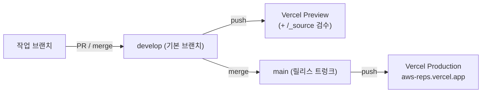
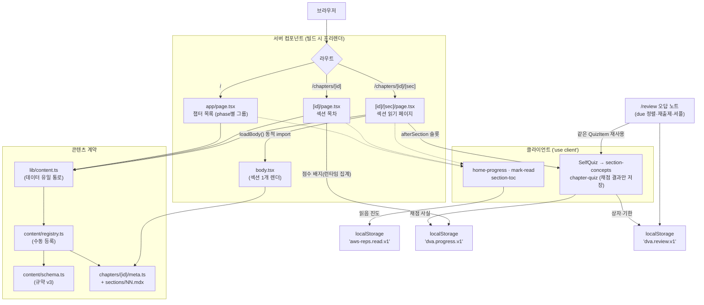
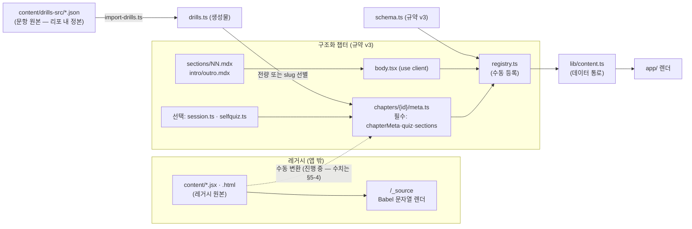
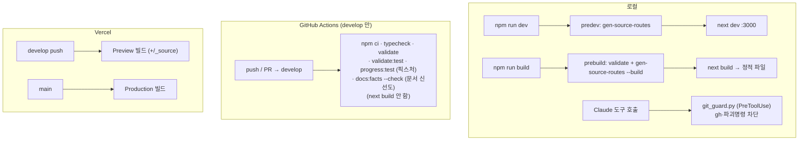

# ARCHITECTURE — aws-reps 구조 안내

> **문서 상태**: **정본 (living doc)** · 최종 반영 2026-07-26 · 점검 커밋 `b2ca68c`
> **갱신법**: 구조가 바뀌면 `docs/prompts/아키텍처안내.md` 프롬프트를 재실행해 **이 파일**을 다시 그린다. 손으로 조금씩 고치면 조용히 낡는다. 진단·점수는 자매 `docs/prompts/아키텍처점검.md`(→ `docs/ARCHITECTURE_REVIEW.md`)의 몫이다.
> **예외 — 생성 블록**: `<!-- BEGIN GENERATED: … -->` 마커 사이는 `scripts/gen-arch-facts.ts`가 코드에서 뽑는 **사실 층**이다. 사람도 프롬프트도 손으로 채우지 말고 `npm run docs:facts`로 다시 만든다 — 낡으면 CI가 막는다(#117).
> **읽는 순서**: "한눈에"만 읽어도 감이 온다. 코드를 만질 사람은 "빠른 시작 → 디렉터리 지도 → 콘텐츠 파이프라인"까지.

---

## 1. 한눈에

**aws-reps**는 **AWS Certified Developer – Associate(DVA-C02) 시험 대비 학습 사이트**다. 한국어로 된 챕터를 읽고, 섹션마다 개념을 되짚고(인출 학습·셀프 퀴즈), 챕터 끝 퀴즈로 확인하는 흐름을 제공한다. 지금은 저자 한 명이 콘텐츠를 채워가는 초기 단계이고, 공개 지향 프로젝트다.

기술적으로 핵심만 추리면:

- **순수 정적 사이트(SSG)** — Next.js를 `output: "export"`로 빌드해 **서버 런타임이 없다**. 어디에나 정적 파일로 배포되고, 진도 같은 상태는 브라우저 localStorage에만 산다(로그인 없음).
- **콘텐츠와 앱이 분리** — 앱(`app/`)은 "셸"이고, 학습 내용은 `content/`의 챕터 모듈이다. 둘 사이의 **데이터 통로는 `lib/content.ts` 하나**뿐이다 — 단 MDX 렌더 팔레트만은 루트 `mdx-components.tsx`가 `content/chapters/ui`를 직접 참조하는 둘째 결합이다(§5).
- **콘텐츠는 규약(계약) 기반** — 모든 챕터는 `content/schema.ts`가 정의한 규약 v3를 따른다. 무엇이 계약인지의 단일 진실이 이 파일이다. 계약은 **필수 3 + 선택 2** 구조라, 챕터마다 학습 장치 보유가 다른 것이 **정상**이다(§5).
- **콘텐츠가 2계층** — 아직 변환 안 된 **레거시 원본**(`.jsx`·`.html`, 앱엔 안 실림)과 **구조화 챕터**가 공존한다. 마이그레이션이 진행 중이고, 그 수치의 정본은 §5-4의 생성 블록이다.
- **가벼운 스택** — Next.js(App Router) · React · MDX · TypeScript(strict). 상태관리·CSS 프레임워크 라이브러리 없음(인라인 스타일 + `globals.css`). 버전 표는 §3.

---

## 2. 빠른 시작

```bash
npm install
npm run dev
```

- 개발 서버가 **http://localhost:3000** 에 뜬다(포트 사용 중이면 자동으로 다음 포트).
- `npm run dev`는 `predev` 훅이 먼저 돈다 → `scripts/gen-source-routes.mjs`가 `/_source`(원본 검수 도구) 라우트를 생성한 뒤 Next dev가 시작된다. **수동 코드생성 단계는 없다.**
- 패키지 매니저는 **npm 고정**이다(`package-lock.json` 커밋됨, yarn/pnpm 혼용 금지).

**선행 조건 — Node 버전**: 버전 정본은 `.nvmrc`(=24)이고 로컬(nvm/fnm)과 CI가 이를 공유한다(#67). `engines`는 의도적으로 두지 않는다 — Vercel이 빌드 Node 선택 입력으로 읽어 현재 정상인 배포를 깨뜨릴 수 있어, 리포가 못 박는 범위를 로컬+CI로 한정했다. 실질 최소치는 Next 16(20.9+)이 아니라 **검증·빌드 스크립트가 좌우한다** — `scripts/*.ts`를 Node가 직접 실행해 네이티브 TS 타입 스트리핑이 필요하고, 이는 Node 20·초기 22엔 없다(안정화 22.18+). 20.9로는 dev는 뜨지만 `npm run validate`·`npm run build`가 깨진다. 그러니 `.nvmrc`대로 **Node 24**(하한 22.18+)를 쓴다.

자주 쓰는 스크립트:

| 명령 | 하는 일 |
|---|---|
| `npm run dev` | 개발 서버 (predev로 /_source 라우트 생성 후 `next dev`) |
| `npm run validate` | 콘텐츠 값 수준 계약 검사 + 사실 블록 신선도 (`validate-content.ts` → `gen-arch-facts.ts --check` 연쇄, #137) |
| `npm run validate:test` | 검사기 자체의 회귀 테스트 (CI 전용) |
| `npm run progress:test` | 진도 저장소 순수 로직(read-repair·쓰기 누적)의 회귀 픽스처 (CI 전용, #214) |
| `npm run docs:facts` | 이 문서의 사실 블록 재생성 (`scripts/gen-arch-facts.ts`; `--check`는 validate 연쇄·CI 게이트) |
| `npm run typecheck` | `tsc --noEmit` 타입 검사 |
| `npm run build` | 정적 빌드 (`prebuild`가 validate + 라우트 생성 선행 → `next build`) |

---

## 3. 큰 그림

**스택** — Next.js는 App Router, TypeScript는 strict다. 버전 표는 `package.json`·`.nvmrc`에서 생성된다(§7의 `docs:facts` 게이트):

<!-- BEGIN GENERATED: stack-versions -->
| 패키지 | 버전 |
|---|---|
| `@mdx-js/loader` | `^3.1.1` |
| `@mdx-js/react` | `^3.1.1` |
| `@next/mdx` | `^16.2.10` |
| `next` | `^16.2.10` |
| `react` | `^19.2.7` |
| `react-dom` | `^19.2.7` |
| `typescript` (dev) | `^5.9.3` |
| Node (`.nvmrc`) | `24` |
<!-- END GENERATED -->

**왜 SSG인가**: `next.config.ts`가 `output: "export"`다 — 빌드하면 순수 HTML/CSS/JS 정적 파일이 나오고 **서버가 필요 없다**. 그래서 호스트에 종속되지 않고, 진도 같은 사용자 상태는 브라우저에만 둔다. 서버 기능(Route Handler·DB·인증)이 필요해지는 날 **이 옵션 한 줄을 제거하는 게 전환 스위치다**(`next.config.ts` 주석이 그렇게 명시).

이 선택의 파급: 모든 페이지가 빌드 시점에 미리 렌더돼야 하므로, 동적 라우트(`[id]`, `[sec]`)는 `generateStaticParams`로 경로를 전부 나열하고 `dynamicParams = false`로 그 외를 막는다.

**배포(Vercel)**:



빌드 설정은 리포에 `vercel.json`이 없다 — **Vercel 대시보드**에서 관리한다. GitHub Actions CI는 빌드를 하지 않고(빌드 검증은 Vercel 프리뷰 담당), develop에서만 타입·검증을 돌린다(§7).

**시스템 지도** — 요청이 화면이 되기까지:



**섹션 페이지가 조립되는 방식**(`app/chapters/[id]/[sec]/page.tsx`)이 이 앱에서 가장 밀도 높은 지점이다:

- URL 번호는 **1-based**이고, `quiz`가 있으면 **마지막 번호가 챕터 퀴즈**다(별도 라우트가 아니다). `sectionCount()`가 그만큼 +1 해 준다.
- 본문 섹션이면 `loadBody()`로 **그 챕터의 섹션 렌더러**를 가져와 `section` 인덱스(0-based) 하나만 렌더한다.
- 그 섹션에 붙는 학습 장치를 `afterSection` 슬롯으로 넘겨 **본문과 아웃트로 사이**에 끼워 넣는다. 순서는 **셀프 퀴즈(판정형) → 개념 인출 카드(서술형)** 다(#113). 붙을 게 없으면 슬롯 자체를 안 넘긴다.

---

## 4. 디렉터리 지도

| 경로 | 무엇 |
|---|---|
| `app/` | Next.js App Router. 라우트·페이지·클라이언트 컴포넌트. 콘텐츠를 `lib/content.ts`로만 소비한다. |
| `app/chapters/[id]/` | 챕터 목차 페이지(`page.tsx`) + 목차(`section-toc`)·퀴즈(`chapter-quiz`) 컴포넌트. |
| `app/chapters/[id]/[sec]/` | **실제 읽기 페이지**(`page.tsx`) + 개념카드(`section-concepts`)·읽음표시(`mark-read`). |
| `app/_source/` | dev·프리뷰 전용 **원본 검수 도구**. 레거시 `.jsx`를 문자열로 읽어 브라우저 Babel로 렌더(§7). |
| `content/` | 학습 콘텐츠. 레거시 원본 `.jsx`(2계층 ①) + `schema.ts`·`registry.ts` + 공용 `ui.tsx`·`interactive.tsx`. |
| `content/chapters/{id}/` | **구조화 챕터**(2계층 ②) — `meta.ts`·`body.tsx`·`sections/NN.mdx`·`intro/outro.mdx`·`figs.tsx`·`drills.ts`(+`session.ts`·`selfquiz.ts`). |
| `lib/` | `content.ts`(앱↔콘텐츠 통로) · `progress.ts`(읽음 진도) · `progress/`(학습 진도 — `records.ts`(브라우저 붙임)·`records-core.ts`(순수 규칙)+`.test.ts`·`keys.ts`) · `reading-time.ts`(예상 소요, 서버 전용). |
| `scripts/` | 빌드·검증·하네스 — `validate-content.ts`·`gen-source-routes.mjs`·`gen-arch-facts.ts`·`import-drills.ts`·`git_guard.py`. |
| `docs/` | 프로젝트 문서. 지도는 `README.md`. 안내(이 문서)·진단·도면 + `design/`·`prompts/`·`reports/`·`_frozen/`. |
| `.claude/` | 하네스 — `settings.json`(훅 등록)·`launch.json`(dev 실행)·`skills/`(issue·land·write-issue·chapter-review). |
| `.github/workflows/` | `ci.yml` — develop 대상 타입·검증 CI. |
| 루트 | `next.config.ts`(output:export+MDX)·`tsconfig.json`·`mdx-components.tsx`·`package.json`·`.nvmrc`. |

> "이거 고치려면 어디 보나": **화면/라우팅** = `app/`, **학습 내용** = `content/chapters/{id}/`, **계약** = `content/schema.ts`, **앱↔콘텐츠 접점** = `lib/content.ts`, **읽음 진도** = `lib/progress.ts`, **퀴즈 결과·학습 진도** = `lib/progress/records-core.ts`(필드·규칙) + `records.ts`(쓰기 진입점).

---

## 5. 콘텐츠 파이프라인 (이 프로젝트의 심장)

콘텐츠는 **2계층**이다:

1. **레거시 날것 원본** — `content/*.jsx`(+`aws-dva-stage0.html`). 예전에 자유 형식으로 쓴 가이드들로, **앱엔 실리지 않는다.** 오직 `/_source` 검수 도구가 이들을 **문자열로 읽어 브라우저 Babel로 변환**해 보여준다(import·번들하지 않음). 서비스별 중복 원본이 있어(iam 2개, lambda 2개 등) 원본 파일 수가 챕터와 1:1은 아니다 — 개수는 §5-4.
2. **구조화 챕터** — `content/chapters/{id}/`. 규약 v3를 따르는 정식 콘텐츠. 앱이 실제로 렌더하는 건 이쪽뿐이다.

### 5-1. 챕터 모듈 계약 — 필수 3 + 선택 2

`content/schema.ts`의 `ChapterData`가 단일 진실이다. **모든 챕터가 똑같이 갖춰야 하는 건 필수 3개**이고, 학습 장치 2개는 **선택**이다:

| 슬롯 | 필수? | 파일 | 내용 |
|---|---|---|---|
| `chapterMeta` | **필수** | `meta.ts` | id·phase·title·domain·examWeight·prerequisites |
| `quiz` | **필수** | `drills.ts` | 챕터 문항. **빈 배열이 적법**(앱은 빈 quiz에 강건해야 한다) |
| `sections` | **필수** | `meta.ts` | 섹션 메타(num·title·sub·freq). **최소 1개**, 빈 배열은 위반 |
| `session?` | 선택 | `session.ts` | 인출 세션 — 개념 카드·도식·교차 대조 |
| `selfQuiz?` | 선택 | `selfquiz.ts` | 섹션 셀프 퀴즈 — 판정형 핵심 사실 덱 (#98) |

**선택 슬롯이 챕터마다 다른 건 드리프트가 아니라 설계다.** `schema.ts`가 두 필드에 *"없는 챕터 적법 — 점진 이행 중"*이라고 못박아 뒀다(`session?` #54, `selfQuiz?` #98). 학습 장치를 챕터별로 순차 추가하는 중이고, 미보유분은 이슈로 추적된다.

챕터별 파일 구성:

- `meta.ts` — 위 계약을 export하는 **순수 데이터**(`"use client"` 금지). `session`·`selfQuiz`는 각 파일에서 re-export한다.
- `body.tsx` — `"use client"` 셸. `{ section, afterSection }` prop으로 **섹션 하나만** 렌더하고, 인트로/아웃트로 배치와 섹션 수 assert만 한다(본문 내용은 없음).
- `sections/NN.mdx` — 섹션 본문(Markdown+JSX). `intro.mdx`/`outro.mdx` — 인트로/말미 체크리스트.
- `figs.tsx` — 챕터 도식·로컬 컴포넌트(인터랙티브 학습장치 포함).
- `drills.ts` — **문항 데이터**. 아래 5-2 참조.

**공용 컴포넌트 2종**(`content/chapters/`): `ui.tsx`는 서버에서도 안전한 본문 프리미티브 팔레트(`Sec`·`Table`·`Code`·`P` 등, 인라인 스타일만 — 네거티브 규정 준수), `interactive.tsx`는 `useState`를 쓰는 것들(`SelfQuiz`·`SimFrame`)이라 파일 단위 `"use client"` 경계를 따로 만든다(#97).

### 5-2. 문항(quiz)이 오는 두 경로

`drills.ts`는 **손으로 쓰는 파일이 아니라 생성물**이다 — `scripts/import-drills.ts`가 리포 내 문항 원본 `content/drills-src/*.json`(#93에서 업스트림 `aws-cloud-drills`로부터 11과목 이관 — 이 리포가 정본, 업스트림은 동결)을 규약 v3 `Question`으로 변환해 만든다. **손편집 금지**이고, 고칠 게 있으면 `drills-src`의 JSON을 고쳐 재실행한다.

`meta.ts`가 그 문항을 챕터 `quiz`로 삼는 방식은 두 가지이며 **둘 다 계약된 패턴**이다:

- **전량 재노출** — `export { quiz } from "./drills.ts"` (ch0-1·ch1-1·ch1-2)
- **부분 선별** — `drills`를 `slug`로 필터해 파생 (ch0-2). `schema.ts`의 `Question.slug?`가 바로 이 "부분 선별의 안정 키"로 존재한다.

### 5-3. 앱이 콘텐츠를 보는 길

챕터를 만들면 `content/registry.ts`에 **손으로 등록**한다(import 줄 + 배열 항목, **배열 순서 = 학습 순서**). 앱은 `lib/content.ts`로만 접근하고 `content/`를 직접 import하지 않는다.

`lib/content.ts`가 제공하는 것: 타입 재노출(평행 타입·어댑터를 만들지 않는다) + `getAllChapters`·`getChapter`·`sectionCount`·`conceptsForSection`·`selfQuizForSection`·`groupByPhase`. (전역 문항 키 `globalQuestionKey` 는 여기 없다 — 정본이 `lib/progress/keys.ts` 다. 이 파일은 서버 전용이라 채점하는 클라이언트가 값으로 import 할 수 없다, #66.) 여기에 더해 **`SelfQuiz` 컴포넌트도 이 파일이 통로 re-export**한다 — 앱이 `content/`를 직접 import하지 않는다는 원칙을 지키기 위해서다(`"use client"` 경계는 원 모듈에 남는다).

> 이 경계의 **예외는 루트 `mdx-components.tsx` 하나**다. MDX 마크다운 프리미티브(`p`·`code` 등)를 챕터 팔레트에 매핑해야 해서 `content/chapters/ui`를 직접 import한다 — 데이터 통로가 아니라 렌더 통합 지점이라 갈라져 있다.



### 5-4. 마이그레이션 현황

이 절의 두 블록은 **스냅샷이 아니라 생성물**이다 — `scripts/gen-arch-facts.ts`가 `registry.ts`·`schema.ts`·`CURRICULUM.md`·`content/` 파일 목록에서 뽑아 쓴다(§7). 손으로 고치지 말고 `npm run docs:facts`로 다시 만든다.

<!-- BEGIN GENERATED: migration-status -->
`content/chapters/`에 **4개** 구조화 완료 — `ch0-1`·`ch0-2`·`ch1-1`·`ch1-2`, 전부 `registry.ts`에 등록됨. `docs/CURRICULUM.md`가 계획한 총 **24개**(0단계 2 + 1단계 4 + 2단계 5 + 3단계 3 + 4단계 6 + 5단계 4) 대비 **4/24**다. 레거시 원본 **28개**(`content/*.jsx` 27 + `.html` 1)는 별개 계층이라 이 분모에 섞지 않는다.
<!-- END GENERATED -->

선택 슬롯 보유가 챕터마다 다른 건 드리프트가 아니라 설계다(§5-1). 아래 표의 열은 `schema.ts`의 `ChapterData` optional 필드에서 나오므로, 선택 슬롯이 늘면 열도 따라 는다.

<!-- BEGIN GENERATED: chapter-inventory -->
| 챕터 | 섹션 | `session` | `selfQuiz` |
|---|---|---|---|
| `ch0-1` | 4 | ✓ | ✓ |
| `ch0-2` | 10 | ✓ | ✓ |
| `ch1-1` | 18 | ✓ | ✓ |
| `ch1-2` | 20 | ✓ | ✓ |
<!-- END GENERATED -->

**MDX 규정**: **remark/rehype 플러그인 금지**(Next 16+Turbopack 불안정, #15). 본문 `.mdx`에서 코드 펜스(` ``` `) 대신 컴포넌트를 쓰고, 마크다운 기본 요소는 루트 `mdx-components.tsx`가 팔레트로 매핑한다.

---

## 6. 상태·진도

localStorage 키가 **셋**이고, 각각 파일 하나가 소유한다. 다른 어떤 코드도 이 키들을 직접 만지지 않는다.

| 키 | 소유 모듈 | 담는 것 |
|---|---|---|
| `"aws-reps.read.v1"` | `lib/progress.ts` | 읽음 진도 — `{ [chapterId]: 읽은 섹션 번호[] }`(1-based, 마무리 페이지 포함) |
| `"dva.progress.v1"` | `lib/progress/records.ts` (쓰기 진입점)<br/>`lib/progress/records-core.ts` (필드·규칙) | 학습 진도 — 문항별 채점 사실 `{ [전역 문항 키]: { attempts, correct, lastResult, lastAt, firstResult? } }` (#66) |
| `"dva.review.v1"` | `lib/progress/review.ts` (입출력)<br/>`lib/progress/review-core.ts` (필드·규칙) | 오답 노트 — 문항별 Leitner 상태 `{ [전역 문항 키]: { box, dueAt, graduatedAt? } }` (#219) |

> **키는 셋인데 채점 진입점은 하나다**(#219). `recordQuestionAttempt`(records.ts)가 진도와 오답 노트를 **같은 시각으로** 함께 갱신한다 — 두 저장소가 서로 다른 순간에서 계산되면 "방금 푼 문항인데 기한이 어제"처럼 앞뒤 안 맞는 상태가 생긴다. 덕분에 채점이 어느 화면에서 일어나든(챕터 퀴즈·오답 노트) 상자 규칙이 저절로 적용된다 — "틀리면 어디서든 상자 1로"(설계 §1-2)가 구현으로도 성립하는 이유다.

> **필드 목록의 정본은 문서가 아니라 코드다**(#207) — `records-core.ts`의 `Progress`·`QuestionRecord`·`ChapterRecord`이고, 설계 문서(§4)가 지키는 것은 "왜 이 필드들인가"다. 그 형이 `records.ts`가 아니라 옆 파일에 있는 이유는 #214다: `records.ts`는 `"use client"` + react import라 node가 못 불러 **CI가 진도 로직을 한 줄도 실행하지 못했다**. 순수 층을 갈라 회귀 테스트(`npm run progress:test`)를 붙였고, 앱은 여전히 `records.ts`만 import한다.

- **전역 문항 키**는 `lib/progress/keys.ts`가 `` `${chapterId}:${slug ?? id}` ``로 합성한다. `q.id`를 쓰지 않는 이유: `drills.ts`는 생성물이고 임포터가 id를 위치대로(`q1`…) 발급해, 원본에 문항이 하나 끼어들면 그 뒤 id가 전부 밀려 **진도가 조용히 엉뚱한 문항에 붙는다**(#69의 선별 결정을 진도 키까지 확대 — PR #202). 저장 데이터가 콘텐츠 규약에 거는 **유일한 하드 의존**이라(설계 §4-2), 검증기가 **해석된 키**의 유일성과 `:` 미포함을 강제한다(`QUESTION_KEY_DUP`·`QUESTION_KEY_DELIMITER`).
- `firstResult`는 첫 채점에만 쓰이고 고정된다 — §2-1의 숙달 판정("첫 시도 정답")이 재응시 뒤에는 복원 불가능하기 때문이다. 읽는 코드는 아직 없고 #86 잔여(숙달 판정·완료 배지)에서 쓴다.
- **Leitner 상자**(`dva.review.v1`)는 상자 3개·간격 1/3/7일이다(설계 §1-2). 오답이면 **어디서 틀렸든** 상자 1·기한 +1일, 기한이 된 문항을 맞히면 한 칸 승급, 상자 3에서 맞히면 졸업(`graduatedAt`)이고 졸업 문항도 다시 틀리면 상자 1로 재진입한다. **기한 전의 정답은 승급시키지 않는다**(설계 D2) — 그 한 줄이 없으면 같은 자리에서 연타해 상자를 통과할 수 있어 간격 반복이 무력화된다. 시도 횟수·정오 이력은 이 키가 복제하지 않는다(진도 키 소관).
- **점수는 저장하지 않는다**. 목차의 "8/11" 배지는 `scope === "final"` 문항의 `lastResult`를 런타임 집계해서 낸다 — 파생 가능한 값을 저장하지 않는다는 설계 원칙(§4-1) 때문이고, 덕분에 재응시가 자동 반영된다.
- **구조 버전**: 키 접미 `.v1`이 메이저, 내부 `v` 필드가 마이너다. 로드 시 read-repair(누락 필드 기본값 주입, 미지 필드 보존)를 하고, **모르는 상위 `v`는 낮추지 않는다**.
- **말이 안 되는 기록은 고치지 않고 버린다** — 앞뒤 안 맞는 값(응시 1회에 맞힘 3회 등)을 살려내려면 "둘 중 어느 쪽이 진짜인가"를 정하는 판단 규칙이 계속 늘어나는데, **이 저장소에는 그런 값을 만드는 경로가 없다**(쓰는 곳이 한 군데뿐이고 항상 정합한 값만 쓴다). 그런 기록은 사람이 저장소를 손으로 고친 것이다. 버리는 단위는 **문항 하나**이고(전체 초기화가 아니다 — 한 글자 때문에 전 챕터 진도가 날아가면 안 된다), 삭제는 다음 저장 때 반영된다.
- **로그인 없음 · 기기 로컬** — 계정·서버 저장이 없다. 다른 기기와 동기화되지 않는다.
- **SSG hydration 처리**: 정적 HTML은 항상 "빈 진도"로 렌더되고, 마운트 후 `useEffect`(`useReadSections`·`useQuestionRecords`)로 localStorage에서 채운다(불일치 방지). 파싱/스토리지 실패(프라이빗 모드 등)는 삼켜서 빈 진도로 강건하게 degrade한다.
- **아직 안 하는 것**(사실 기술, 평가 아님): `dva.progress.v1`의 `chapters`(열람·완료 스냅샷)는 **형만 있고 쓰는 코드가 없다**. 개념 카드·셀프 퀴즈는 여전히 `useState`로만 살아서 결과가 저장되지 않는다. 숙달 판정·완료 배지·진도 대시보드(전체 진행률·도메인 커버리지)·진도 초기화 UI 없음 — 에픽 #86 잔여. 선택지 셔플도 `/review`에만 적용돼 있다(챕터 퀴즈는 원본 순서 — SSG 선렌더 HTML과의 hydration 때문, #219). (부채·개선 우선순위 판단은 `아키텍처점검.md` 몫.)

---

## 7. 빌드·검증·하네스

정적 사이트라 런타임 방어가 없는 만큼, **빌드·검증 게이트가 계약을 강제**한다.

- `scripts/validate-content.ts` (`npm run validate`) — TypeScript가 못 잡는 **값 수준 계약**을 검사한다: 챕터 id 전역 유일, 섹션 ≥1·제목 비지 않음·`num` 챕터 내 유일, `prerequisites`가 실존 챕터 참조, 문항의 `concept` ≥1·`choices` ≥2·`answer` 범위·중복 없음·`choiceExplanations` 길이 일치, 인출 세션 id 유일(concepts·mixed 한 이름공간)·카드 `section`이 실존·도식 `edges = nodes-1`, 셀프 퀴즈 규칙(#98). `prebuild`와 CI 양쪽이 돌린다.
- `scripts/gen-source-routes.mjs` — `/_source` 검수 라우트 코드생성. 손으로 쓴 소스는 `app/_source/`(언더스코어 = Next private 폴더라 라우팅 안 됨, 커밋됨)이고, 실제 라우트 `app/%5Fsource/`는 100% 생성물이라 gitignore다. `predev`는 그냥, `prebuild`는 `--build`로 호출 — **Vercel 프리뷰에서만 라우트를 유지**하고 프로덕션·로컬 빌드에선 통째로 제외한다(실유저 배포본에 9MB 날것 원본이 안 실리게).
- `scripts/gen-arch-facts.ts` (`npm run docs:facts`) — **이 문서의 사실 블록 생성기**. `<!-- BEGIN GENERATED: … -->` 마커 사이만 `registry.ts`·`schema.ts`·`CURRICULUM.md`·`package.json`·`.nvmrc`·`content/` 파일 목록에서 다시 쓰고, 마커 밖 서술은 건드리지 않는다. `--check`는 생성 결과가 파일과 다르면 diff를 찍고 실패한다 — CI가 이걸 돌려 **문서가 낡으면 PR이 깨진다**(#117), 그리고 #137부터 `npm run validate`가 끝에 연쇄 실행해 로컬·`prebuild`에서도 잡힌다. 도입 이유는 손으로 베낀 인벤토리가 두 번 연속 낡은 채 발견된 것(#109).
- `scripts/validate-content.test.ts` (`npm run validate:test`) · `lib/progress/records-core.test.ts` (`npm run progress:test`) — **픽스처 회귀 테스트 2종**. 러너를 들이지 않고 node가 직접 실행하며(24의 타입 스트리핑), 어긋나면 종료 코드 1로 CI를 깬다. 앞은 *검사기 자신*이 규칙을 여전히 잡는지, 뒤는 *진도 저장소*가 저장값을 여전히 옳게 고치고 누적하는지 본다(#214 — 그 파일은 화면이 아니라 **학습 이력의 영속 계층**이라 틀린 값이 조용히 쌓인다).
- `scripts/import-drills.ts` — 별도 리포의 문항 JSON → `drills.ts` 변환 어댑터(§5-2).
- `scripts/git_guard.py` — `.claude/settings.json`에 등록된 **PreToolUse 훅**. gh CLI를 **기본 차단**(fail-closed)하고 홈 마커 + 개인 계정(padahkim) 두 조건을 모두 만족할 때만 허용하며, 파괴적 명령(`rm -rf`, `git push --force`, `git reset --hard` 등)을 막는다.



주의: `prebuild`에는 typecheck·validate:test·progress:test가 **없다**(CI 전용). `docs:facts --check`는 #137부터 `validate` 연쇄로 **포함된다** — 문서가 낡으면 로컬·Vercel 빌드도 깨진다(구조 드리프트를 CI 전에 로컬에서 잡는 게 의도). CI는 develop만 트리거하고 빌드는 Vercel이 한다.

---

## 8. 기여 흐름 (요지 — 상세는 `CLAUDE.md`)

- **브랜치**: `develop`이 GitHub 기본 브랜치이자 통합 지점(Vercel 프리뷰 자동 배포). 작업 브랜치(`feat/*`·`fix/*`·`docs/*`·`chore/*`·`content/*`)는 최신 `develop`에서 분기. `main`은 릴리스 트렁크(직접 커밋 금지, `develop`→`main` 머지로만).
- **과제 = GitHub Issues 단일 진실**. 새 과제·버그는 발견 즉시 이슈로(`/write-issue`). 로드맵은 **에픽 큐**로 관리하고 에픽 착수 관문은 타임박스 spike다(WIP 1). 별도 백로그 md 금지.
- **작업 단위 = 이슈 1개**: 구현 → 프리뷰 확인 → `/land`로 착지(기본 PR, 본문 `closes #N`으로 자동 닫힘). 세션 종료 전 반드시 착지.
- 회사(gh 차단) 머신에선 이슈를 GitHub 웹으로, 착지는 plain git으로 — 규칙은 동일.

---

## 9. 용어 · 더 읽기

- **SSG** (Static Site Generation) — 빌드 때 페이지를 미리 렌더해 정적 파일로 내보내는 방식. 여기선 `output: "export"`.
- **RSC / 서버 컴포넌트** — 클라이언트 JS 없이 서버(빌드 시)에서 렌더되는 컴포넌트. `"use client"`는 그 자리에서 **클라이언트 경계를 선언**한다 — 경계 아래로 import되는 모듈은 지시어가 없어도 클라이언트 번들에 포함돼 브라우저에서 돈다(예: `app/progress-bar.tsx`는 지시어 없이도 클라이언트 컴포넌트가 import해 클라에서 실행). 즉 지시어는 "이 모듈만 클라"가 아니라 "여기서부터 클라"라는 뜻이다.
- **MDX** — Markdown 안에서 JSX 컴포넌트를 쓰는 형식. 섹션 본문 형식.
- **규약 v3** — `content/schema.ts`가 정의한 챕터 모듈 계약(무엇을 export해야 하는가). v3에서 본문이 TSX 함수 → MDX 파일로 이동.
- **인출 세션 / 셀프 퀴즈** — 섹션 하단 학습 장치 2층. 셀프 퀴즈(`selfQuiz`)가 판정형 핵심 사실로 먼저 오고, 카드(`session`)가 서술·정교화로 뒤를 받는다(#113). 둘 다 선택 슬롯이다(§5-1).
- **drills** — 별도 리포에서 가져온 문항 데이터. `drills.ts`는 생성물이라 손편집하지 않는다.
- **hydration** — 정적 HTML에 클라이언트 JS가 붙어 상호작용이 살아나는 과정. 진도는 그 이후 채워진다.
- **`/_source`** — dev·프리뷰 전용, 레거시 원본을 브라우저 Babel로 미리 보는 검수 도구.

**더 읽기**: [`docs/README.md`](README.md) (문서 지도) · [`CLAUDE.md`](../CLAUDE.md) (규칙 전문) · [`docs/CURRICULUM.md`](CURRICULUM.md) (커리큘럼 도면·24챕터 트리) · [`docs/design/APP_ARCHITECTURE_DRAFT.md`](design/APP_ARCHITECTURE_DRAFT.md) (초기 *제안* — 구현물 아님, 아래 주의) · 진단은 자매 문서 [`docs/ARCHITECTURE_REVIEW.md`](ARCHITECTURE_REVIEW.md).

> ⚠ **`design/APP_ARCHITECTURE_DRAFT.md`는 옛 설계 제안이라 현행과 다르다.** 그 초안의 `lib/contract/` 어댑터·공용 `Quiz`+`ChapterProvider`는 **구현되지 않았다.** 2키 진도 모델은 `dva.progress.v1`(#66)에 이어 `dva.review.v1`(#219)까지 들어왔고, `app/review/`도 생겼다 — 단 설계 정본은 그 초안이 아니라 `design/LEARNING_LOOP_DRAFT.md` §1·§4다(초안의 `{addedAt, clearedAt?}` 대신 Leitner 상태를 담는다). 현행 정본은 `schema.ts` + `registry.ts` + `lib/content.ts` + `lib/progress.ts` + `lib/progress/` + `app/` 실제 트리다. `docs/_frozen/`도 폐기 보관본이다.

---

*이 문서는 `docs/prompts/아키텍처안내.md` 프롬프트로 생성·유지됩니다.*
