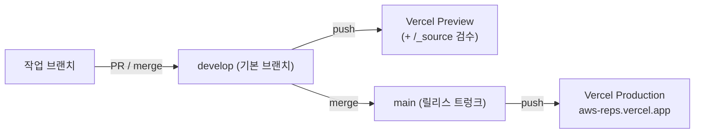
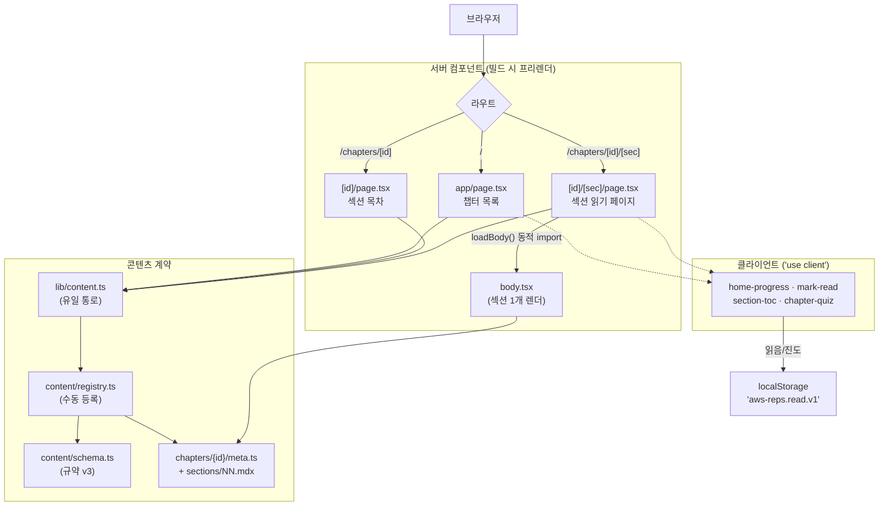
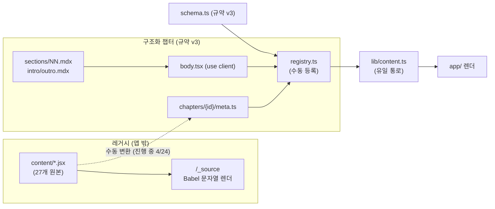
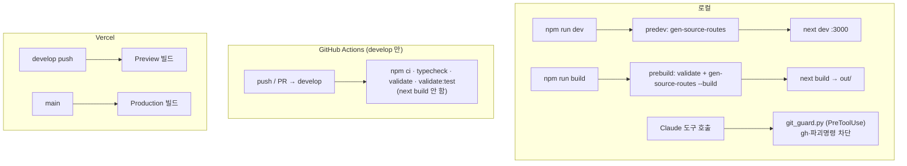

# ARCHITECTURE — aws-reps 구조 안내

> **문서 상태**: **비교용 임시 초안** (`ARCHITECTURE2.md` — 정본 정리는 #83) · 콘텐츠 검증 기준 커밋 `2f1db5f` · 작성 2026-07-22
> **갱신법**: 이 파일은 임시본이다 — 살아있는 **정본은 `docs/ARCHITECTURE.md`**이고, 구조가 바뀌면 `docs/prompts/아키텍처안내.md` 프롬프트를 재실행해 **그 파일**을 다시 그린다(이 `ARCHITECTURE2.md`가 아니다). 진단·점수는 자매 `docs/prompts/아키텍처점검.md`(→ `docs/ARCHITECTURE_REVIEW.md`)의 몫이다.
> **읽는 순서**: "한눈에"만 읽어도 감이 온다. 코드를 만질 사람은 "빠른 시작 → 디렉터리 지도 → 콘텐츠 파이프라인"까지.

---

## 1. 한눈에

**aws-reps**는 **AWS Certified Developer – Associate(DVA-C02) 시험 대비 학습 사이트**다. 한국어로 된 챕터를 읽고, 섹션마다 개념을 되짚고(인출 학습), 챕터 퀴즈로 확인하는 흐름을 제공한다. 지금은 저자 한 명이 콘텐츠를 채워가는 초기 단계이고, 공개 지향 프로젝트다.

기술적으로 핵심만 추리면:

- **순수 정적 사이트(SSG)** — Next.js를 `output: "export"`로 빌드해 **서버 런타임이 없다**. 어디에나 정적 파일로 배포되고, 진도 같은 상태는 브라우저 localStorage에만 산다(로그인 없음).
- **콘텐츠와 앱이 분리** — 앱(`app/`)은 "셸"이고, 학습 내용은 `content/`의 챕터 모듈이다. 둘 사이엔 **단 하나의 통로**(`lib/content.ts`)만 있다.
- **콘텐츠는 규약(계약) 기반** — 모든 챕터는 `content/schema.ts`가 정의한 규약 v3를 따른다. 무엇이 계약인지의 단일 진실이 이 파일이다.
- **콘텐츠가 2계층** — 아직 변환 안 된 **레거시 원본**(27개 `.jsx`, 앱엔 안 실림)과 **구조화된 챕터**(현재 4개)가 공존한다. 마이그레이션이 진행 중이다.
- **가벼운 스택** — Next.js 16 · React 19 · MDX · TypeScript. 상태관리·CSS 프레임워크 라이브러리 없음(인라인 스타일 + `globals.css`).

---

## 2. 빠른 시작

```bash
npm install
npm run dev
```

- 개발 서버가 **http://localhost:3000** 에 뜬다(포트 사용 중이면 자동으로 다음 포트).
- `npm run dev`는 `predev` 훅이 먼저 돈다 → `scripts/gen-source-routes.mjs`가 `/_source`(원본 검수 도구) 라우트를 생성한 뒤 Next dev가 시작된다. **수동 코드생성 단계는 없다.**
- 패키지 매니저는 **npm 고정**이다(`package-lock.json` 커밋됨, yarn/pnpm 혼용 금지).

**선행 조건 — Node 버전**: 리포가 `engines`/`.nvmrc`로 버전을 못 박아두지 않았다(온보딩 갭). 실질 최소치는 Next 16(20.9+)이 아니라 **검증·빌드 스크립트가 좌우한다** — `scripts/*.mts`를 Node가 직접 실행해 네이티브 TS 타입 스트리핑이 필요하고, 이는 Node 20·초기 22엔 없다(안정화 22.18+). 20.9로는 dev는 뜨지만 `npm run validate`·`npm run build`가 깨진다. 그러니 **Node 22.18+(권장 24 — CI·로컬 검증과 동일)** 를 쓴다.

자주 쓰는 스크립트:

| 명령 | 하는 일 |
|---|---|
| `npm run dev` | 개발 서버 (predev로 /_source 라우트 생성 후 `next dev`) |
| `npm run validate` | 콘텐츠 값 수준 계약 검사 (`scripts/validate-content.mts`) |
| `npm run typecheck` | `tsc --noEmit` 타입 검사 |
| `npm run build` | 정적 빌드 (`prebuild`가 validate + 라우트 생성 선행 → `next build`) |

---

## 3. 큰 그림

**스택**: Next.js 16(App Router) · React 19 · MDX(`@next/mdx`) · TypeScript 5(strict).

**왜 SSG인가**: `next.config.ts`가 `output: "export"`다 — 빌드하면 순수 HTML/CSS/JS 정적 파일(`out/`)이 나오고 **서버가 필요 없다**. 그래서 호스트에 종속되지 않고, 진도 같은 사용자 상태는 브라우저에만 둔다. 서버 기능(Route Handler·DB·인증)이 필요해지는 날 이 옵션 한 줄을 제거하는 게 전환 스위치다.

이 선택의 파급: 모든 페이지가 빌드 시점에 미리 렌더돼야 하므로, 동적 라우트(`[id]`, `[sec]`)는 `generateStaticParams`로 경로를 전부 나열하고 `dynamicParams = false`로 그 외를 막는다.

**배포(Vercel)**:



빌드 설정은 리포에 `vercel.json`이 없다 — **Vercel 대시보드**에서 관리한다. GitHub Actions CI는 빌드를 하지 않고(빌드 검증은 Vercel 프리뷰 담당), develop에서만 타입·검증만 돌린다(§7).

**시스템 지도** — 요청이 화면이 되기까지:



---

## 4. 디렉터리 지도

| 경로 | 무엇 |
|---|---|
| `app/` | Next.js App Router. 라우트·페이지·클라이언트 컴포넌트. 콘텐츠를 `lib/content.ts`로만 소비한다. |
| `app/chapters/[id]/` | 챕터 목차 페이지(`page.tsx`) + 목차/퀴즈 컴포넌트. |
| `app/chapters/[id]/[sec]/` | **실제 읽기 페이지**(`page.tsx`) + 섹션 개념카드·읽음표시 컴포넌트. |
| `app/_source/` | dev·프리뷰 전용 **원본 검수 도구**. 레거시 `.jsx`를 문자열로 읽어 브라우저 Babel로 렌더(§5). |
| `content/` | 학습 콘텐츠. 레거시 원본 `.jsx`(2계층 ①) + `schema.ts`·`registry.ts`. |
| `content/chapters/{id}/` | **구조화 챕터**(2계층 ②) — `meta.ts`·`body.tsx`·`sections/NN.mdx`·`intro/outro.mdx`·`figs.tsx` 등. |
| `lib/` | `content.ts`(앱↔콘텐츠 유일 통로) · `progress.ts`(진도 저장소). |
| `scripts/` | 빌드·검증·하네스 — `validate-content.mts`·`gen-source-routes.mjs`·`git_guard.py` 등. |
| `docs/` | 이 문서·`CURRICULUM.md`(커리큘럼 도면)·`APP_ARCHITECTURE_DRAFT.md`(옛 제안)·`prompts/`·`_frozen/`(폐기 보관). |
| `.claude/` | 하네스 — `settings.json`(훅 등록)·`launch.json`(dev 실행)·`skills/`(issue·land·write-issue). |
| `.github/workflows/` | `ci.yml` — develop 대상 타입·검증 CI. |
| 루트 | `next.config.ts`(output:export+MDX)·`tsconfig.json`·`mdx-components.tsx`·`package.json`. |

> "이거 고치려면 어디 보나": **화면/라우팅** = `app/`, **학습 내용** = `content/chapters/{id}/`, **계약** = `content/schema.ts`, **앱↔콘텐츠 접점** = `lib/content.ts`, **진도** = `lib/progress.ts`.

---

## 5. 콘텐츠 파이프라인 (이 프로젝트의 심장)

콘텐츠는 **2계층**이다:

1. **레거시 날것 원본** — `content/*.jsx` **27개**(+`aws-dva-stage0.html`). 예전에 자유 형식으로 쓴 가이드들로, **앱엔 실리지 않는다.** 오직 `/_source` 검수 도구가 이들을 **문자열로 읽어 브라우저 Babel로 변환**해 보여준다(import·번들하지 않음). 서비스별 중복 원본이 있어 파일 27개가 챕터와 1:1은 아니다.
2. **구조화 챕터** — `content/chapters/{id}/`. 규약 v3를 따르는 정식 콘텐츠. 앱이 실제로 렌더하는 건 이쪽뿐이다.

**규약 v3**(`content/schema.ts`, 단일 진실)의 챕터 파일 구성:

- `meta.ts` — `chapterMeta` + `quiz` + `sections`(+선택 `session`)를 export하는 계약. 순수 데이터.
- `body.tsx` — `"use client"` 셸. `{ section }` prop으로 **섹션 하나만** 렌더하고, 인트로/아웃트로 배치와 섹션 수 assert만 한다(본문 내용은 없음).
- `sections/NN.mdx` — 섹션 본문(Markdown+JSX). `intro.mdx`/`outro.mdx` — 인트로/말미 체크리스트.
- `figs.tsx` — 챕터 도식·로컬 컴포넌트(인터랙티브 학습장치 포함). `session.ts`/`drills.ts` — 인출 세션·문제 데이터.

MDX 규정: **remark/rehype 플러그인 금지**(Next 16+Turbopack 불안정). 본문 `.mdx`에서 코드 펜스(` ``` `) 대신 컴포넌트를 쓰고, 마크다운 기본 요소는 루트 `mdx-components.tsx`가 팔레트로 매핑한다.

**앱이 콘텐츠를 보는 길**: 챕터를 만들면 `content/registry.ts`에 **손으로 등록**한다(import 줄 + 배열 항목, 배열 순서 = 학습 순서). 앱은 `lib/content.ts`(`getAllChapters`·`getChapter`·`sectionCount`·`conceptsForSection`·`groupByPhase` 등)로만 접근하고 `content/`를 직접 import하지 않는다.



**마이그레이션 현황**: `content/chapters/`에 **4개** 구조화 완료 — `ch0-1`(4섹션)·`ch0-2`(10)·`ch1-1`(18)·`ch1-2`(20), 전부 registry 등록됨. 인출 `session`은 현재 **ch0-1만** 보유. `docs/CURRICULUM.md` 트리는 총 **24개** 챕터를 계획한다 → **4/24 구조화**(레거시 원본 27개는 별개 계층).

---

## 6. 상태·진도

- **읽음 진도만** 저장한다. `lib/progress.ts`가 localStorage 단일 키 **`"aws-reps.read.v1"`** 에 `{ [chapterId]: 읽은 섹션 번호[] }`(1-based, 퀴즈 페이지 포함)를 둔다.
- **로그인 없음 · 기기 로컬** — 계정·서버 저장이 없다. 다른 기기와 동기화되지 않는다.
- **SSG hydration 처리**: 정적 HTML은 항상 "빈 진도"로 렌더되고, 마운트 후 `useEffect`로 localStorage에서 채운다(불일치 방지). 파싱/스토리지 실패(프라이빗 모드 등)는 삼켜서 빈 진도로 강건하게 degrade한다.
- **아직 안 하는 것**(사실 기술, 평가 아님): 퀴즈 결과 영속화 없음, 오답노트 없음, 진도 초기화 UI 없음. (부채·개선 우선순위 판단은 `아키텍처점검.md` 몫.)

---

## 7. 빌드·검증·하네스

정적 사이트라 런타임 방어가 없는 만큼, **빌드·검증 게이트가 계약을 강제**한다.

- `scripts/validate-content.mts` (`npm run validate`) — TypeScript가 못 잡는 **값 수준 계약**을 검사한다: 챕터 id 전역 유일, 섹션 ≥1·섹션번호 유일, 선행 챕터 실재, 퀴즈 선택지 ≥2·정답 범위, 인출 세션 규칙 등. `prebuild`와 CI 양쪽이 돌린다.
- `scripts/gen-source-routes.mjs` — `/_source` 검수 라우트 코드생성. `predev`는 그냥, `prebuild`는 `--build`로(프리뷰에서만 라우트 유지, 프로덕션·로컬 빌드에선 제외). 생성물 `app/%5Fsource/`는 gitignore.
- `scripts/git_guard.py` — `.claude/settings.json`에 등록된 **PreToolUse 훅**. gh CLI(개인 계정+홈 마커일 때만 허용)와 파괴적 명령(`rm -rf`, `git push --force`, `git reset --hard` 등)을 차단한다.



주의: `prebuild`에는 typecheck·validate:test가 **없다**(그건 CI 전용). CI는 develop만 트리거하고 빌드는 Vercel이 한다.

---

## 8. 기여 흐름 (요지 — 상세는 `CLAUDE.md`)

- **브랜치**: `develop`이 GitHub 기본 브랜치이자 통합 지점(Vercel 프리뷰 자동 배포). 작업 브랜치(`feat/*`·`fix/*`·`docs/*`·`content/*`)는 최신 `develop`에서 분기. `main`은 릴리스 트렁크(직접 커밋 금지, `develop`→`main` 머지로만).
- **과제 = GitHub Issues 단일 진실**. 새 과제·버그는 발견 즉시 이슈로(`/write-issue`). 로드맵은 **에픽 큐**로 관리(WIP 1). 별도 백로그 md 금지.
- **작업 단위 = 이슈 1개**: 구현 → 프리뷰 확인 → `/land`로 착지(기본 PR, 본문 `closes #N`으로 자동 닫힘). 세션 종료 전 반드시 착지.
- 회사(gh 차단) 머신에선 이슈를 GitHub 웹으로, 착지는 plain git으로 — 규칙은 동일.

---

## 9. 용어 · 더 읽기

- **SSG** (Static Site Generation) — 빌드 때 페이지를 미리 렌더해 정적 파일로 내보내는 방식. 여기선 `output: "export"`.
- **RSC / 서버 컴포넌트** — 클라이언트 JS 없이 서버(빌드 시)에서 렌더되는 컴포넌트. `"use client"`는 그 자리에서 **클라이언트 경계를 선언**한다 — 경계 아래로 import되는 모듈은 지시어가 없어도 클라이언트 번들에 포함돼 브라우저에서 돈다(예: `app/progress-bar.tsx`는 지시어 없이도 클라이언트 컴포넌트가 import해 클라에서 실행). 즉 지시어는 "이 모듈만 클라"가 아니라 "여기서부터 클라"라는 뜻이다.
- **MDX** — Markdown 안에서 JSX 컴포넌트를 쓰는 형식. 섹션 본문 형식.
- **규약 v3** — `content/schema.ts`가 정의한 챕터 모듈 계약(무엇을 export해야 하는가). v3에서 본문이 TSX 함수 → MDX 파일로 이동.
- **hydration** — 정적 HTML에 클라이언트 JS가 붙어 상호작용이 살아나는 과정. 진도는 그 이후 채워진다.
- **`/_source`** — dev·프리뷰 전용, 레거시 원본을 브라우저 Babel로 미리 보는 검수 도구.

**더 읽기**: [`CLAUDE.md`](../CLAUDE.md) (규칙 전문) · [`docs/CURRICULUM.md`](CURRICULUM.md) (커리큘럼 도면·24챕터 트리) · [`docs/APP_ARCHITECTURE_DRAFT.md`](APP_ARCHITECTURE_DRAFT.md) (초기 *제안* — 구현물 아님, 아래 주의) · 진단은 자매 문서 `docs/ARCHITECTURE_REVIEW.md`(`docs/prompts/아키텍처점검.md`로 생성).

> ⚠ **`APP_ARCHITECTURE_DRAFT.md`는 옛 설계 제안이라 현행과 다르다.** 그 초안의 `lib/contract/` 어댑터·2키 진도 모델(`dva.progress.v1`/`dva.review.v1`)·`app/review/`·공용 `Quiz`+`ChapterProvider`는 **구현되지 않았다.** 현행 정본은 `schema.ts` + `registry.ts` + `lib/content.ts` + `lib/progress.ts` + `app/` 실제 트리다. `docs/_frozen/`도 폐기 보관본이다.

---

*이 문서는 `docs/prompts/아키텍처안내.md` 프롬프트로 생성된 초안(`ARCHITECTURE2.md`)입니다.*
