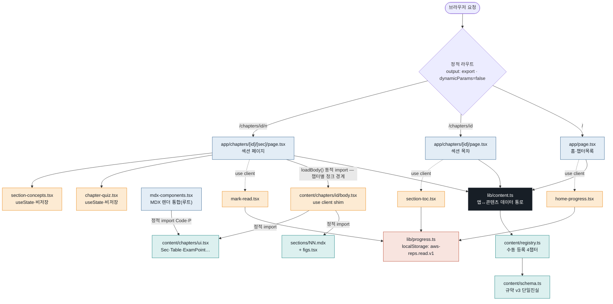
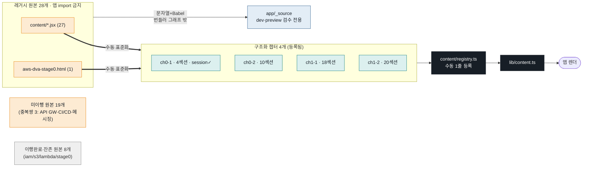
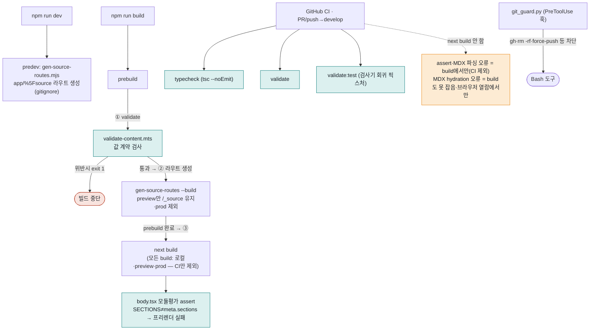
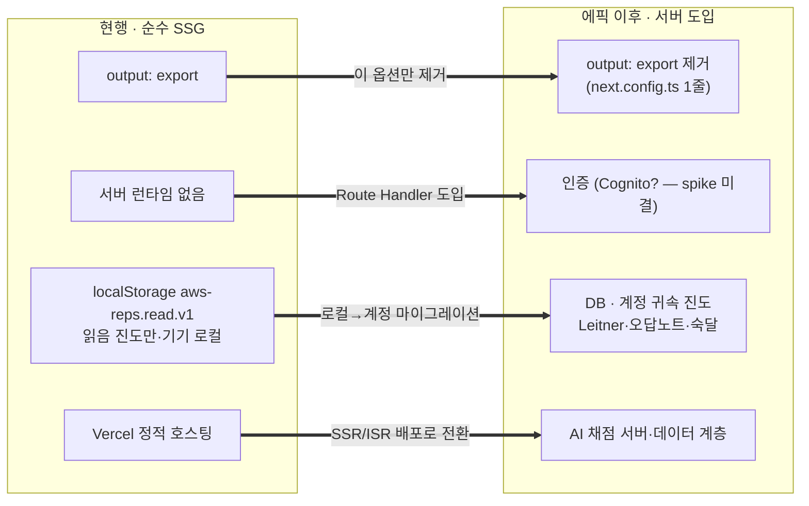

# ARCHITECTURE_REVIEW.md — aws-reps 아키텍처 진단 리포트

> **지위**: **진단·건강검진 리포트**(프롬프트 `docs/prompts/아키텍처점검.md` 산출물). 현행 구조를 쉽게 설명하는 **안내서는 자매 문서 `docs/ARCHITECTURE.md`**(프롬프트 `아키텍처안내.md` 산출물 — #83에서 정본 착지)의 몫이며, 이 리포트는 그 안내서를 as-built 기준선으로 삼아 대조·채점한다. **아래 §3도 as-built 기준을 자체 보유**하므로 이 리포트는 단독으로도 성립한다. 설계 *제안* 초안 [`APP_ARCHITECTURE_DRAFT.md`](design/APP_ARCHITECTURE_DRAFT.md)·[`LEARNING_LOOP_DRAFT.md`](design/LEARNING_LOOP_DRAFT.md)는 제안 문서로 남기고 §5에서 현행과 대조한다.
> **작성 방법**: 읽기 전용 진단 + 5축 병렬 심층 리뷰 후 각 발견을 코드에 대해 반증 검증(21건 발견 / 21건 확정 / 0건 반증) + 자동 리뷰(Codex) 2라운드 반영. 모든 판단에 `파일:라인` 근거.
> **기준 커밋**: 진단 시점 `develop` 계열(24f7625). 파일 수·라인은 이 시점 기준이며, 코드가 정본이다 — 이름이 나오는 파일이 옮겨졌으면 코드를 따른다.

---

## 1. 한눈 요약

- **스택**: Next.js 16 (App Router) + React 19 + TypeScript strict. 본문은 `@next/mdx` (remark/rehype 플러그인 **0개**). 스크립트는 Node 네이티브 TS(strip-types)로 직접 실행.
- **배포**: `output: "export"` — **서버 런타임 없는 순수 정적 사이트(SSG)**. `develop` push → Vercel 프리뷰(+`/_source` 검수), `main` → 프로덕션. 진도는 `localStorage`뿐, 로그인 없음.
- **핵심 결정 3가지**: ① 콘텐츠 2계층 — 레거시 날것 원본(import 금지·검수 전용)과 규약 v3 구조화 챕터를 분리하고, 앱 **데이터**는 `lib/content.ts` 단일 통로로 소비한다(단 MDX 렌더 팔레트는 루트 `mdx-components.tsx`가 `content/chapters/ui`를 직접 참조하는 둘째 통로가 있다 — §4-C). ② 규약(`content/schema.ts`)이 챕터 계약의 단일 진실이고, 값 수준 계약의 **상당수**를 빌드 게이트(`validate-content.mts`)가, 섹션 수 불일치를 `body.tsx` 모듈평가 assert가 잡는다(단 일부 값 불변식은 미강제 — §5 M-1·M-2). ③ 본문 표현은 TSX 셸 + MDX 산문으로, 섹션 단위 정적 라우트(`/chapters/{id}/{n}`)로 프리렌더된다.
- **구조 규모**: 레거시 원본 **28개**(27 `.jsx` + 1 `.html`) → 구조화 챕터 **4개**(ch0-1/0-2/1-1/1-2) 등록. 이 4개가 CURRICULUM §5의 **릴리즈 1(MVP) 콘텐츠 세트와 정확히 일치**한다.
- **건강 상태 (루브릭 총점 = 3.3 / 5)**: **관측 21건** = 높음 0 / 중간 3 / 낮음 18 — 단 이 21건이 전부 "코드 결함"은 아니다: 실제 코드 debt는 소수(발견 B·D-6)이고, 다수는 합리적 단순화(D-1·D-2)·MVP 스코프 결손(D-3~D-5·D-7)·격리된 legacy 관찰이다. **깨진 코드로 인한 릴리즈 차단은 없다**. 구조화 파이프라인·규약 경계·강건성 견고(4점대), 상태·진도 최저(2점). **별건 — MVP 범위 결손**: CURRICULUM이 MVP로 요구하는 학습/복습 루프의 런타임 상태 계층이 부재하다(§7-C) — 그 계층은 이 진단으로 신설한 **에픽 #86(Phase3 · MVP-유저 기능)**이며(개념카드 세션 #53은 별개 축), 릴리즈 1을 이 없이 낼지는 인간의 범위 결정 사항으로 플래그한다.

---

## 2. 시각화

### 2-A. 시스템 지도 — 요청에서 상태까지

> 파란=서버 컴포넌트, 주황=`"use client"`, 청록=콘텐츠, 빨강=상태, 검정=데이터 통로. **두 경계를 구분해야 한다** — (1) **서버 프리렌더**: `output:"export"`에선 `"use client"` 본문까지 `next build`가 정적 HTML로 미리 렌더한다(본문 산문도 HTML에 포함 → SEO/초기 표시 O). "서버 없음"이 아니라 "요청 시점 서버 없음". (2) **클라이언트 모듈·hydration 경계**: `body.tsx`가 `"use client"`라 정적 import한 섹션 MDX·`intro/outro`·`figs.tsx`·`ui.tsx`까지 **본문 서브트리 전체가 클라 모듈 그래프에 들어가 JS를 싣고 hydrate**된다(`content/chapters/ch0-2/body.tsx:1-20`). 클라 JS가 전혀 없는 순수 서버는 라우트 셸(`page.tsx`들)뿐이다. **청크 분리 지점은 `registry.ts`의 `loadBody()` 동적 import(SP→BODY)** 이고 BODY→MDX/figs/ui는 정적 import라, 챕터 본문 청크는 body 진입점 하나로 묶인다. 퀴즈·개념카드·진도는 그 위 별도 클라 리프. 데이터 통로는 `lib/content.ts` 하나이나, MDX 렌더 팔레트만은 루트 `mdx-components.tsx`가 `content/chapters/ui`를 직접 참조하는 둘째 결합이다(§4-C).

### 2-B. 콘텐츠 파이프라인 — 레거시에서 렌더까지

> 28개 원본 = **8개 이행완료**(구조화 챕터로 흡수됐지만 검수용으로 잔존) + **19개 미이행** + **1개 템플릿**(`dva-chapter-template.jsx`). 구조화 챕터에는 네거티브 규정 위반 **0건**, 레거시에는 63건이 있으나 완전히 격리된다(§4-C).

### 2-C. 빌드·검증 게이트 — 무엇을 언제 막나

### 2-D. static → server 전환 (현행 vs 에픽 이후)

### 2-E. 아키텍처 건강 루브릭 (한눈)

| 항목 | 점수 | 막대 |
|---|---|---|
| 콘텐츠 파이프라인 | 4 / 5 | ████████░░ |
| 상태·진도 | **2 / 5** | ████░░░░░░ |
| 빌드·툴링·하네스 | 3 / 5 | ██████░░░░ |
| 규약·경계 일관성 | 4 / 5 | ████████░░ |
| 확장성·서버 준비도 | 3 / 5 | ██████░░░░ |
| 강건성 | 4 / 5 | ████████░░ |
| **총점** | **3.3 / 5** | ██████▌░░░ |

> 가장 낮은 2개 = **상태·진도(2)**와 **빌드·툴링·하네스(3)**. 다음 우선순위 근거는 §6·§7.

---

## 3. 축별 현행 구조 (as-built)

### 3-0. 스택·빌드·배포

- **패키지·스크립트 체인** (`package.json`): `predev` → `gen-source-routes.mjs`(검수 라우트 생성); `prebuild` → `validate` + `gen-source-routes.mjs --build`; `build` → `next build`. `validate`/`validate:test`/`typecheck`는 독립 실행. 패키지 매니저 npm 고정, `package-lock.json` 커밋.
- **`output: "export"`의 의미** (`next.config.ts:4-10`): 배제되는 것은 **요청 시점(request-time) 서버 실행**이다 — 미들웨어, 요청 시 SSR/동적 렌더, 동적 Route Handler, ISR/요청시 재검증. **빌드 시점은 살아 있다**: 서버 컴포넌트는 빌드 때 실행되고 빌드에 정적으로 해소되는 데이터 접근·정적 GET Route Handler 파일 방출도 가능하다(이 앱의 라우트 셸이 곧 빌드 시점 서버 컴포넌트다). 즉 "서버 없음"이 아니라 "요청 시점 서버 없음". 주석이 전환 지점을 명시한다 — *"서버 기능이 필요해지면 이 옵션만 제거한다."*
- **MDX** (`next.config.ts:12-16`): `createMDX({})` — remark/rehype 플러그인 없음(Next 16+Turbopack 불안정, #15 결정). Mermaid·하이라이트가 필요하면 플러그인이 아니라 클라이언트 컴포넌트로 도입하도록 규약이 못박음(`content/schema.ts:22-23`).
- **tsconfig** (`tsconfig.json`): `strict: true`, `allowJs: false`, `allowImportingTsExtensions: true`, `moduleResolution: "bundler"`, `paths: { "@/*": ["./*"] }`. 단 `noUncheckedIndexedAccess`는 미설정 — `sections[n-1]`·`SECTIONS[section]`이 non-undefined로 타입되어 `body.tsx`가 자체 런타임 인덱스 가드를 둔다(`content/chapters/ch0-2/body.tsx:40`).
- **CI** (`.github/workflows/ci.yml`): PR·push(→`develop`)에서 Node 24 고정 + `npm ci` + `typecheck` + `validate` + `validate:test`. **`next build`는 CI에서 돌리지 않는다**(주석 명시, #28 — 빌드 검증은 Vercel 프리뷰 담당).
- **배포**: `develop`→프리뷰(`/_source` 검수 포함), `main`→프로덕션. 프로덕션 export 산출물은 `out/`에 챕터별 정적 HTML로 떨어진다(`out/chapters/ch0-1/1.html`..`5.html` = 4섹션 + 퀴즈).

### 3-1. 축1 — 콘텐츠 파이프라인 (2계층)

- **① 레거시 날것 원본**: `content/*.jsx`(27) + `content/aws-dva-stage0.html`(1) = **28개**. 앱은 이들을 **절대 import 하지 않는다**. 검수 도구 `/_source`만이 `readFileSync`로 **문자열**을 읽어 브라우저에서 Babel-standalone으로 변환·렌더한다(`app/_source/SourcePage.tsx:16-19`, `app/_source/BabelRender.tsx`). 이유(과거·방어적): 원본이 SWC가 거부하는 구문을 담을 수 있고 — 대표 사례인 dynamodb의 escape 안 한 날 `>`(`stock > :zero`)는 `ca8634a`에서 이미 수정됐고 기준 커밋의 27개는 현재 모두 파싱된다 — 그런 파일이 번들러 그래프에 들어가면 dev 서버 전체가 sticky 500으로 죽는다(`BabelRender.tsx:10-17`). 격리 설계는 그 과거 사고와 향후 불완전 원본·번들 비호환을 대비한다. `/_source` 라우트는 `predev`가 만들고(gitignore, `app/%5Fsource/`) `prebuild --build`가 preview 외 빌드에서 제거한다 — 실유저 배포본에 9MB 원본이 실리지 않는다.
- **② 구조화 챕터**: `content/chapters/{id}/` (규약 v3). 파일 구조 = `meta.ts`(순수 데이터) + `body.tsx`(`"use client"` shim) + `intro/outro/sections/NN.mdx`(산문) + `figs.tsx`(챕터 도식·로컬 컴포넌트) + 선택 `session.ts`·`drills.ts`.
- **앱이 보는 경로**: `content/registry.ts`(소비하는 유일 목록, **수동 등록**) → `lib/content.ts`(앱↔콘텐츠 **데이터 통로**, 평행 타입 없이 schema 타입 re-export). 단 데이터가 아닌 **MDX 렌더 팔레트**는 루트 `mdx-components.tsx`가 `content/chapters/ui`의 `Code`·`P`를 직접 import한다 — 데이터 경로와 별개의 둘째 결합(§4-C).
- **마이그레이션 현황**: **4/28 등록**. 등록 4개 = ch0-1(4섹션), ch0-2(10섹션), ch1-1(18섹션), ch1-2(20섹션) = 릴리즈 1 세트. 원본 28개의 내역 = 이행완료 8 + 미이행 19 + 템플릿 1.
- **MDX 규정 준수**: 구조화 MDX **60개 파일**(52 섹션 + 8 intro/outro) 전수 스캔 결과 코드펜스 0·다중행 텍스트태그 0·`<style>`/외부리소스/`window`/`document` 0·볼드 flanking 실패 0 — **완전 준수**. 예시(`content/chapters/ch0-2/sections/06.mdx`): `../../ui` 프리미티브와 `../figs` 로컬 컴포넌트를 import하고, `>`는 `&gt;`로, 텍스트 담는 컴포넌트는 한 줄로 쓴다.

### 3-2. 축2 — 상태·진도

- **저장소** (`lib/progress.ts`): localStorage **단일 키 `aws-reps.read.v1`**, 모델 `{ [chapterId]: number[] }` — 읽은 섹션 번호(1-based, 퀴즈 섹션 포함) 배열만. 버전 필드 없음, read-repair/마이그레이션 없음.
- **hydration 처리**: SSG HTML은 항상 "빈 진도"로 렌더되므로 `useReadSections`가 `useEffect`로 마운트 후 채운다(`lib/progress.ts:47-53`) — 불일치 없음. 파싱 실패·스토리지 접근 불가는 `try/catch → {}` + `Array.isArray`·`Number.isInteger` 필터로 강건(`lib/progress.ts:14-27`).
- **읽음 신호**: 섹션 페이지 방문 = 읽음(`app/chapters/[id]/[sec]/mark-read.tsx`가 마운트 시 무조건 기록). 퀴즈 섹션 페이지도 방문만으로 읽음 처리된다(§5 발견 참조).
- **진도 외 상태 = 없음**: 퀴즈 시도·정답 이력·오답노트·Leitner 상자 **전부 미저장**. `chapter-quiz.tsx`는 순수 `useState`(선택/제출)로, 언마운트·이동 시 소실(`app/chapters/[id]/chapter-quiz.tsx:38-39,55-58`). 개념 인출 카드 열림 상태도 비저장 `useState`(`section-concepts.tsx:28`).

### 3-3. 축3 — 빌드·툴링·하네스

- **`validate-content.mts`** (값 수준 계약 검사, `prebuild`+CI 연결): 순수 함수 `validateChapters()`를 export해 픽스처가 직접 먹인다. 검사 항목 = 챕터 id 유일, 섹션 최소1·title·num(비어있음/중복), prerequisites(실존·자기참조), 문항 concept·choices≥2·answer(비어있음/범위/중복)·choiceExplanations 길이, 세션 id 유일·concept.section 실존·q/a 비어있음·diagram edges=nodes-1.
- **`validate-content.test.mts`** (검사기 회귀 픽스처): **주요** 규칙을 고의로 깨뜨린 입력이 잡히는지 + 적법 입력(빈 quiz·session 없음 등)이 통과하는지 확인. 단 **모든 코드를 다 덮지는 않는다** — 예: `SESSION_ID_EMPTY`(공백 세션 id) 분기(`validate-content.mts:171`)는 픽스처가 없어, 그 공백 검사만 퇴행해도 `validate:test`가 통과한다. 회귀 커버리지는 규칙 전수가 아니라 주요 규칙에 한정.
- **`gen-source-routes.mjs`**: `/_source` 검수 라우트·매니페스트 생성. `--build`는 `VERCEL_ENV=preview`에서만 라우트를 유지하고 그 외엔 제거.
- **`import-drills.mts`**: aws-cloud-drills `<subject>.json` → `content/chapters/<id>/drills.ts`(커밋되는 생성물, 손편집 금지). `SUBJECT_TO_CHAPTER` 매핑 = s3→ch1-1, lambda→ch1-2, aws-basics→ch0-1, iam→ch0-2.
- **`git_guard.py`** (PreToolUse 훅, `.claude/settings.json` 등록): gh CLI 기본 차단(홈 마커+개인 계정일 때만 허용) + 파괴적 명령(`rm -rf`·`push --force`·`reset --hard`·`clean -f`·`branch -D`) 차단.

---

## 4. 규약·경계

### 4-A. 규약 v3 요지 (`content/schema.ts`)

`ChapterData` = `{ chapterMeta, quiz: Question[], sections: SectionMeta[], session? }`. 핵심 계약:
- **섹션 규약(v2)**: `meta.sections`가 섹션 목록의 단일 진실. `body.tsx`의 default export는 `{ section: number; afterSection?: ReactNode }`를 받아 **인덱스 하나만** 렌더(RSC는 클라 모듈 배열 export를 인덱싱 못 하므로 prop 방식). 본문 섹션 수 ≠ `meta.sections.length`면 모듈평가에서 throw.
- **빈 배열 적법성**: `quiz` 빈 배열 적법(앱이 강건해야 함), `sections`는 최소 1(빈 배열 위반), `session` 없는 챕터 적법(점진 이행).
- **인출 세션(#54/#58)**: `session.concepts[].section === sections[].num` 매핑, 카드 열림 v1 비저장. `diagram`은 선형 체인(edges=nodes-1)이 안 맞으면 생략, `mixed` 빈 배열 적법.
- **본문 네거티브 규정**: ✗자체 내비/사이드바/페이저 ✗전역 셀렉터 스타일 ✗`document`/`window` ✗외부 리소스.

### 4-B. 불변식 ↔ 게이트 매핑

| 불변식 | 강제 게이트 | 근거 |
|---|---|---|
| 타입·리터럴 유니온 (examWeight 1..5, freq, scope, difficulty) | **tsc** | `schema.ts:80,93,107,114` (meta.ts가 소스 리터럴로 작성) |
| 챕터 id 유일 / 섹션 최소1·title·num·중복 / prereq 실존·자기참조 | **validate-content** | `validate-content.mts:28-93` |
| 문항 concept≥1 / choices≥2 / answer 비어있음·범위·중복 / choiceExpl 길이 | **validate-content** | `validate-content.mts:100-159` |
| 세션 id 유일·비어있음 / concept.section 실존 / q·a 비어있음 / diagram edges=nodes-1 | **validate-content** | `validate-content.mts:166-221` |
| 본문 섹션 수 = meta.sections.length | **body.tsx 모듈평가 assert** (프리렌더 시 body import → 발동) | `content/chapters/ch0-2/body.tsx:22-24` |
| 섹션 인덱스 범위 (`if (!S)`) | **없음** — 런타임 방어일 뿐(빌드는 `1..sectionCount`만 생성해 발동 안 함) | `content/chapters/ch0-2/body.tsx:40` |
| MDX 규정(코드펜스·다중행 태그·`<style>`·외부리소스·볼드 flanking) | **없음** (저자·리뷰 규율) | §5 발견 M-3 |
| `Question.id` 유일·비어있음 | **없음** | §5 발견 M-1 |
| q.scenario·q.explanation·choices·mixed 필드·diagram.prompt 비어있음 | **없음** | §5 발견 M-2 |
| section.num 제로패딩 형식(00 시작 허용) | **없음** (비어있음·중복만) | §5 발견 L |
| 앱 데이터 ↛ content 직접 import | **없음** (규율만; MDX UI 결합은 예외) | §5 발견 B / §4-C |

### 4-C. 경계 침범 여부

- **"앱은 content/를 직접 import 안 함" — 데이터는 성립, UI 결합 1건 존재**: 앱 **데이터**는 `lib/content.ts` 한 통로로만 흐른다(+검수 전용 `app/_source`는 문자열로 읽음). 그러나 루트 `mdx-components.tsx:2`가 `@/content/chapters/ui`의 `Code`·`P`를 **직접 import**한다 — @next/mdx의 앱 전역 통합 지점이라 검수 도구도 아니고, MDX 기본 요소를 콘텐츠 팔레트에 매핑하려면 필연적 결합이다. 즉 경계는 "**데이터 단일 통로 + MDX 렌더의 UI 결합 1건**"이고 "유일 통로"는 데이터에 한정된 표현이다. 어느 쪽도 **기계적 강제가 없다**(ESLint·`no-restricted-imports`·dependency-cruiser 부재) — 실제로 이 UI 결합이 최초 진단의 `app/`-한정 grep을 조용히 빠져나갔다는 사실 자체가 발견 B(무강제)를 예증한다.
- **본문 네거티브 규정**: 구조화 콘텐츠 위반 **0건**. 레거시 원본은 63건(`window.` 14·`document.` 15·`<style` 19·`fonts.googleapis` 15)이나 import 금지 + `/_source` prod 제외로 **완전 격리** — 배포본 영향 0.
- **팔레트 중복(경계 존중형)**: `chapter-quiz.tsx:13-14`·`section-concepts.tsx:16-17`이 `ui.tsx`의 색값을 import하지 않고 **복제**한다 — 앱이 content/를 직접 import하지 않기 위한 의도적 중복(문서화됨). 색 드리프트 리스크는 작으나 평행 상수다.
- **registry 수동 등록 확장성**: 챕터당 import 1줄 + 배열 1항목(`content/registry.ts:26-47`). 4→28로 갈 때 손 유지 목록이지만, id 유일성·계약은 게이트가 잡는다. 자동 발견(glob) 없음 — 정적 import 요구·명시성 위해 의도적. `session`은 ch0-1만 배선됨(신규 챕터가 session.ts 추가 시 registry 배선을 잊기 쉬운 수동 footgun).

---

## 5. 건강 진단 (발견)

> 발견 21건 전수 반증 검증 완료(확정 21 / 반증 0). 심각도는 검증자가 하향 교정한 최종값. **높음 0 · 중간 3 · 낮음 18.**

### 중간 (3건 — 다음에 손볼 후보)

**M-1 · `Question.id` 유일성·비어있음을 어떤 게이트도 강제하지 않음** (`gate-coverage`)
세션 id는 `checkId()`로 중복·공백을 잡지만(`validate-content.mts:167-182,221`), 문항 id는 quiz 루프(`:96-160`)가 concept/choices/answer만 보고 id는 안 본다. 중복·빈 `q.id`가 tsc+validate+validate:test를 통과한 뒤 `chapter-quiz.tsx:241`의 React key를 충돌시키고(재조정 깨짐·dev 경고) `globalQuestionKey`도 충돌시킨다. 세션과 문항 사이 **비대칭**. → **이슈 [#77](https://github.com/padahkim/aws-reps/issues/77)** 등록(validate 게이트 하드닝).

**M-2 · 값 수준 비어있음 검사가 선택적** (`gate-coverage`)
`concept`·`section.title`·세션 `q/a`는 비어있음을 검사하나, `q.scenario`(`schema.ts:107`)·`q.explanation`(`:110`)·개별 choices·`SessionMixedItem`의 scenario/service/why/contrast(`:221`은 id만 검사)·`SessionDiagram.prompt`는 **미검사**. 빈 `explanation`은 채점 후 해설 패널이 공백으로 렌더되고(`chapter-quiz.tsx:196-200`), 빈 `scenario`는 빈 문항으로 렌더된다(`:91`) — 전부 게이트 통과. 원칙 없는 누락. → **이슈 [#77](https://github.com/padahkim/aws-reps/issues/77)** 에 M-1과 함께 포함.

**M-3 · CI가 `next build`를 돌리지 않아 body-assert·MDX 오류가 CI를 빠져나감 — 그리고 hydration 오류는 어떤 build도 못 잡음** (`gate-coverage`)
CI는 typecheck+validate+validate:test만 실행(`ci.yml:31-35`). `validate`는 `registry`를 import하나 `body`는 lazy `import()`라 평가되지 않는다(`registry.ts:34-38`). 따라서 **섹션 수 불일치 assert·MDX 파싱 오류**는 `next build`(로컬 `npm run build` 또는 Vercel — CI만 build를 안 돌림)에서 검출된다(섹션 인덱스 초과 `if (!S)`는 빌드가 유효 param `1..sectionCount`만 생성해 발동하지 않는 **런타임 방어**다 — §4-B, build 검출 아님). 그러나 **MDX hydration 오류(다중행 텍스트 태그 → 중첩 `
`, `schema.ts:26-27`)는 build도 못 잡는다** — 프리렌더는 HTML을 방출할 뿐 브라우저에서 hydrate하지 않으므로, 이 부류는 CI·build 둘 다 통과해 **브라우저 열람(수동 프리뷰 확인)에서만** 드러난다. 결함 PR이 CI green으로 머지될 수 있다. *완화*: land 스킬이 프리뷰 확인을 필수화하므로 프로덕션 전에 잡힌다(그래서 중간). 파싱류는 의도된 CI 결정(#28)이라 이슈화 선택; hydration류는 게이트가 원천적으로 없어 브라우저 수동 확인이 유일한 방어다.

### 낮음 (18건 — 요지)

- **B · 콘텐츠 import 경계가 산문으로만 선언, 기계 강제 없음** (`boundary`/debt): ESLint·lint 스크립트·dependency 규칙 부재. 현재는 규율로 성립하나 미래 컴포넌트가 `content/`·`ui.tsx`를 직접 import해도 막을 게 없다. lint 규칙 1개로 값싸게 닫힘. → 이슈 [#77](https://github.com/padahkim/aws-reps/issues/77) 범위 제외(별개 lint 메커니즘) — 별도 chore 후보.
- **draft-gap 7건** (§5-대조 참조): D-1·D-2는 reasonable-simplification, D-3·D-4·D-5·D-7은 **MVP 범위·미구현**(§7-C — 학습/복습 루프 상태 계층 부재), D-6는 debt. 실제 코드 debt는 발견 B(경계 lint)와 D-6(localStorage divergence)이고, D-3~D-5·D-7은 코드 결함이 아니라 MVP 스코프 결손이다.
- **robustness 4건**:
  - `[sec]` 라우트에 빈-레지스트리 자리표시자 가드 없음(`[id]`엔 있음). 레지스트리가 비면 `[sec]/page.tsx:12-19`가 `[]`를 반환해 `output:export`가 "missing generateStaticParams"로 빌드 실패. 잠재적(현재 4챕터 등록). → 2줄 수정.
  - `ProgressBar`가 pct를 clamp 안 함(`progress-bar.tsx:6`) — 두 호출부가 done≤total을 보장하나 클램프가 컴포넌트가 아닌 호출부에 있음. 잠재.
  - 모듈평가 assert가 import 배열 길이만 보고 `sections/` 디렉터리 파일 수는 안 봄 — orphan `NN.mdx`가 조용히 미렌더될 수 있음(현재 0건).
  - `globalQuestionKey`(`lib/content.ts:55`)는 **죽은 코드**(호출부 0) — 미구현 학습 루프를 위한 선행 stub.
- **legacy 4건** (전부 격리·설계상 의도): dynamodb 메모리 stale(아래), 미이행 중복쌍 3(API GW·CI/CD·메시징), 이행완료 원본 8개 잔존(검수용, manifest에 상태 마커 없음), 네거티브 규정 63건 격리.
- **section.num 형식 미강제**(`static-ceiling`): 제로패딩 2자리 형식을 게이트가 안 봄(비어있음·중복만, `:61-74`). 문자열 일치(`:187`)로 우연히 맞물려 meta.num·mdx 파일명·body import 순서 드리프트가 안 잡힘. → 이슈 [#77](https://github.com/padahkim/aws-reps/issues/77)에 포함. **주의**: `schema.ts:90`은 "01".."NN"으로 적었으나 ch0-1은 **"00"부터** 쓴다(동기 서문, `ch0-1/meta.ts:28`). #77 규칙은 "01 시작"이 아니라 "**제로패딩 연속(00 시작 허용)**"으로 정의해야 현행 ch0-1을 빌드에서 깨뜨리지 않는다.
- **ch0-1 인트로를 섹션 index 1에 렌더 — 규약 line 41 기준 deviation**(`consistency`): `INTRO_AT=1`(`ch0-1/body.tsx:25`) — 00이 동기 부여 서문이라 의도·문서화된 선택이지만, **규약 문구가 자기모순적이다**: `schema.ts:41`(+`:16-18`)은 인트로를 "첫 섹션 페이지 상단"으로 못박는 반면 `schema.ts:14`는 인트로/아웃트로 "배치"를 body 책임으로 넘긴다. ch0-1은 그 틈에서 기본(index 0)을 벗어나므로 **line 41 기준으론 명백한 예외**다 — "버그 아님"으로 뭉개기보다 예외로 기록해야 저자·검증기에 안 숨는다. 정리 방향: 규약 문구를 "명시적 인트로 인덱스 허용"으로 다듬거나, 이 이탈을 계약 예외로 명시. (검증기가 인트로-at-0을 강제하면 ch0-1을 false-flag한다.)

### 메모리 정정 (§5-M-stale)

`dynamodb-guide.jsx:889`이 escape 안 한 `>`를 담는다는 **자동 메모리 노트는 stale/false**. 현재 `"stock &gt; :zero"`로 **이미 escape됨**(커밋 `ca8634a`, 2026-07-18 `fix(content): escape a raw > in dynamodb-guide JSX`). 파일 어디에도 JSX 텍스트 내 unescaped `>` 없음. → 세션 메모리(`MEMORY.md`·`source-review-tool.md`)를 정정한다.

### 5-대조 · Draft ↔ as-built 괴리 (현행 문서화의 알맹이)

| # | DRAFT 상정 | as-built | 판정 |
|---|---|---|---|
| D-1 | `lib/contract/` 어댑터 3파일 (types/adapter/registry, 내부 AppChapterMeta/AppQuestion) — 규약 churn 흡수 | `lib/contract/` **부재**. `lib/content.ts`가 schema 타입 **직접 re-export**(평행 타입 없음), 검증은 빌드 게이트로 이관 | **합리적 단순화** — 규약이 v3 확정·단일진실이라 평행 타입은 항등 매핑 의례. 능력 손실 0 (`lib/content.ts:2-4`) |
| D-2 | `components/Quiz.tsx` + `ChapterProvider.tsx` (context로 quiz 주입, props 금지) | `components/`·context **부재**. `chapter-quiz.tsx`가 **props**로 받고 형제 섹션 페이지로 배선 | **합리적 단순화** — context는 자유-jsx 본문 "내부"에서 quiz를 읽으려던 것. v3가 퀴즈를 독립 섹션 페이지(N+1)로 올려 문제 자체가 소멸(`[sec]/page.tsx:72`) |
| D-3 | `app/review/` 오답노트 라우트 + standalone Quiz | **부재**(디렉터리·라우트·내비 없음) | **MVP·미구현** — 리포 정본 CURRICULUM §4-3(`docs/CURRICULUM.md:119`)이 오답노트 기록·재출제를 MVP 앱 요구로 명시. 전용 보드 에픽은 미확인. 배포 의존은 0이나 **스코프상 MVP 결손이지 "게이트 뒤"가 아니다** |
| D-4 | **확정된**[인간 2026-07-14] Leitner 상자·`dva.progress.v1`/`dva.review.v1`·attempts/correct/box/dueAt/graduatedAt·숙달 5상태·due·약점개념·도메인 커버리지 대시보드·`lib/progress/store.ts` | **전부 미구현**. `lib/progress.ts` 읽음추적만, 퀴즈 결과 비저장 | **MVP·미구현** — 확정 설계(quiz 오답 재출제/Leitner). CURRICULUM §4-3가 MVP로 요구, 이 진단으로 에픽 **#86(Phase3)** 신설. (별개 축: 개념카드 **인출 세션**은 에픽 #53=**Phase1**, #58 Done·#59/#74 Todo로 일부 착수.) 선행 hook `globalQuestionKey`는 죽은 stub |
| D-5 | 3대시보드 지표(전체 진행률·오늘의 복습·도메인 커버리지) | 홈은 챕터 목록 + 챕터별 읽음 바만(`app/page.tsx:42-63`) | **MVP·미구현** (CURRICULUM §4-4 진도추적/커버리지·D-4 종속) |
| D-6 | 네임스페이스 `dva.*`, 2키, `{chapters:{visitedAt}}`, 내부 `v` 필드 + read-repair | `aws-reps.read.v1`, 1키, `{[id]:number[]}`, 버전 필드 없음 | **debt(낮음)** — 확정 §4 스펙과 이름·모델 불일치. 네임스페이스 변경 시 구 키를 **compat-read**해 읽음 진도를 보존해야 한다 — `aws-reps.read.v1`은 섹션을 연 사용자면 실제로 채워지는 데이터라 "비용 0"이 아니다(도그푸딩 단일 사용자라 규모만 작다). 퀴즈 이력은 애초 미저장이라 Leitner 상태는 전원 빈 값에서 시작 |
| D-7 | 완료(ch) ⇔ 열람 ∧ finalQ 마지막시도 ≥80% (D7) | 방문=읽음, 퀴즈 페이지 방문만으로 진도 100% 도달(`[sec]/page.tsx:79`) | **MVP·미구현/재조정** — 의도된 MVP 단순화(#7)로 `progress.ts`가 "읽음 진도"라 정직히 라벨하나, 확정 완료 조건(finalQ≥80%)과 라이브 divergence. 학습루프가 MVP라 §2-3 착수 시 재조정 필요 |

---

## 6. 루브릭 점수 (재실행 시 추세 비교용 — 항목·척도 고정)

> 척도: 1=심각한 결손·릴리즈 차단 / 2=동작하나 큰 부채 / 3=동작·알려진 부채 수용 가능 / 4=견고·소소한 개선점 / 5=모범.

| 항목 | 점수 | 근거 (대표 `파일:라인`) |
|---|---|---|
| **콘텐츠 파이프라인** | **4** | 2계층 분리 깔끔·격리 완전, MDX 60파일 100% 준수, 구조화 위반 0. 감점 = MDX 무게이트(저자규율) + 수동 registry(4→28 손유지). `content/registry.ts:26-47`, 60 mdx 스캔 0위반 |
| **상태·진도** | **2** | 읽음추적은 동작·hydration 안전·파싱강건. 그러나 **확정 학습루프(Leitner/시도/숙달) 전부 미구현**, 퀴즈결과 소실, 네임스페이스·완료조건 divergence, 계정 귀속 경로 0. `lib/progress.ts:10-12`, `chapter-quiz.tsx:38-39` |
| **빌드·툴링·하네스** | **3** | validate 계약 견고 + 회귀픽스처 + Node24 CI + git_guard. 알려진 부채 = 게이트 커버리지 구멍(M-1·M-2·M-3), 형식·경계 무게이트. `validate-content.mts`, `ci.yml:31-35` |
| **규약·경계 일관성** | **4** | schema 단일진실 준수·평행타입 0, 데이터 경계 성립(+MDX 렌더 UI 결합 1건은 필연, §4-C), draft 괴리 관리 양호. 감점 = 경계 기계 강제 부재(발견 B — UI 결합이 grep을 빠져나감) + 일부 불변식 무강제. `lib/content.ts:1-19`, `mdx-components.tsx:2` |
| **확장성·서버 준비도** | **3** | SSG로 동작·전환지점 국소화(config 1줄)·SSR 호환 라우팅. 감점 = 서버 스캐폴딩 0 + 3에픽(인증·DB·AI) 순net-new 대량 + 로컬→계정 마이그레이션. `next.config.ts:4-10`, `lib/progress.ts` |
| **강건성** | **4** | 빈 quiz·session 없음·파싱실패·notFound·done>total·복수정답 전부 처리. 감점 = `[sec]` 빈-레지스트리 비대칭 + ProgressBar 무clamp(둘 다 잠재). `lib/progress.ts:14-27`, `lib/content.ts:30-39` |
| **총점** | **3.3** | 단순 평균 (4+2+3+4+3+4)/6 = 20/6 |

**가장 낮은 2개 = 다음 우선순위**: ① **상태·진도(2)** — 확정 설계 대비 가장 뒤처짐(재조정 debt D-6·D-7). 소유가 명확해졌다: 개념카드 세션 #53(Phase1)은 비저장 `useState`라 이 축을 안 올리고, 실제 결손인 **퀴즈 지속·Leitner·오답노트 계층**은 이 진단으로 신설한 에픽 **#86(Phase3)**이다(D-4) — 그 에픽 착수가 정면 해소다. ② **빌드·툴링·하네스(3)** — 지금 값싸게 올릴 수 있는 축(validate 커버리지 M-1·M-2 = #77, 경계 lint B). 즉 **근래 손볼 것은 하네스(게이트 하드닝), 큰 재작업은 상태·진도(에픽, 우선 이슈부터)** 로 갈린다.

---

## 7. 확장 지점

### 7-A. static → server 전환

- **전환 트리거**: 어떤 에픽이 **요청 시점 서버 런타임을 요구할 때** `output: "export"` 제거가 관문(`next.config.ts:8` 주석이 이미 지시). 단 전부가 서버를 요구하진 않는다 — 인증·계정 진도는 정적 유지 + 클라이언트 인증(Cognito 임시 자격증명 → 외부 API)으로도 가능하고, AI 채점만 서버가 사실상 전제다(§7-B).
- **제거 시 열리는/바뀌는 것**: ① 배포 모델에 SSR/ISR·Vercel 함수 옵션이 열림(정적 호스팅은 그대로도 가능). ② `/_source` gen-route 우회(정적 export 전용 Next 버그 회피)가 불필요해짐. ③ `dynamicParams=false`+`generateStaticParams` 패턴은 유지 가능하나 ISR/SSR 옵션이 열림.
- **엮지 말 것**: 진도의 서버 DB 이관은 `output:export` 제거의 **결과가 아니다** — 옵션을 지워도 기존 페이지는 계속 정적 프리렌더되고 진도는 localStorage로 남을 수 있다. 진도 이관은 '**계정 도입**'이 부르는 별개 변경이고, 그마저 클라 인증 경로(Cognito 임시 자격증명)면 서버 DB·`output:export` 해제 없이도 가능하다(§7-B).
- **국소성 — 콘텐츠 경계만 좁고, 진도는 아니다**: 콘텐츠 경계(`lib/content.ts`)는 단일 파일이라 전환 표면이 좁다. 그러나 진도는 "한 모듈 교체"가 아니다 — `lib/progress.ts`는 **동기 클라이언트 모듈**(`"use client"`, `lib/progress.ts:1,14-53`)이고 3개 클라이언트 소비자(`useReadSections` 훅·`markSectionRead`)가 이를 동기 호출한다. 계정 귀속으로 가려면 **소비자 3곳의 동기→비동기 전환 + 로딩/에러 처리가 필수**이고, 백엔드는 **선택**이다: (a) Next 서버 경로 — 인증된 Route Handler/Server Action(+`output:export` 해제), 또는 (b) 정적 유지 — 클라이언트 인증(Cognito 임시 자격증명 등)으로 허용된 외부 API 직접 호출(장기 DB 시크릿을 번들에 안 넣음). 인증 방식이 spike 미결이라 어느 경로도 아직 확정 아니지만, 확실한 건 "파일 하나 스왑이 아니다"이다.

### 7-B. 에픽 준비도

- **인증**: 진도 모델 마이그레이션이 핵심 — 현행 `aws-reps.read.v1`(익명·기기·**동기 localStorage**)를 계정 귀속으로 옮기려면 ① 구 키 **compat-read**로 기존 읽음 진도 보존(§7-A·D-6 — 비어있지 않을 수 있는 실 데이터), ② 확정 §4-1 스펙(`dva.progress.v1`/`dva.review.v1`)과 네임스페이스·모델 재조정, ③ 소비자 3곳의 동기→비동기 전환 + 백엔드 선택(Next 서버 경로 또는 정적+클라 인증 — §7-A, spike 미결). 어느 쪽이든 파일 하나 교체가 아니다. `globalQuestionKey`(죽은 stub)가 그 gk 합성 지점을 예약해 둠.
- **유저 기능(학습 루프 — 두 갈래, 둘 다 MVP지만 Phase가 다름)**: ① **개념카드 인출 세션** = 에픽 **#53(Phase1)** — SessionData 규약·섹션 카드는 #58로 착수됨(ch0-1 적용, 열림 상태는 비저장 useState), #59/#74가 잔여. ② **퀴즈 Leitner/오답노트 저장소**(확정 LEARNING_LOOP·D-4) = 이 진단으로 신설한 에픽 **#86(Phase3 · MVP-유저 기능)** — `dva.progress/review` 상태 계층·재출제·숙달·대시보드가 **백지**. 규약(`schema.ts`)은 데이터 타입을 확정해 뒀으나 퀴즈 결과의 **런타임 지속 계층이 없다**. 이 ②(#86)가 상태·진도 축을 2점으로 누른 주 원인이다.
- **AI 채점**: 서버/데이터 계층이 전제. 현 구조에 해당 스캐폴딩 0 — output:export 해제 + Route Handler + (문항·답안·채점) 데이터 계층 신설이 필요. `Question`·`SessionConcept` 규약은 채점 대상 데이터 형태를 이미 제공.

### 7-C. MVP(Phase1~4) 결손 (구조만 — 콘텐츠 분량·품질은 범위 외)

- **콘텐츠 세트**: ✅ **구조적 완비**. 릴리즈 1 = ch0-1·ch0-2·1-1·1-2 (CURRICULUM §5) = 등록된 4챕터와 정확히 일치.
- **앱 셸**: ✅ 커리큘럼 내비·챕터 로더·섹션 퀴즈 엔진(즉시 채점·해설·복수정답)·읽음 진도 동작.
- **MVP 결손 (구조) — 학습/복습 루프가 MVP 범위인데 상태 계층이 부재**: 리포 정본 CURRICULUM이 **오답 노트 기록·재출제를 MVP 앱 요구로 명시**하고(§4-3, `docs/CURRICULUM.md:119`), 릴리즈 1의 존재 이유를 그 학습 루프의 도그푸딩으로 둔다(§5, `:124`). 보드가 이를 확증한다 — 개념카드 인출은 **#53(Phase1, #58 Done)**, 퀴즈 지속·Leitner·오답노트는 이 진단으로 신설한 **#86(Phase3)**, 둘 다 MVP(Phase1~4) 안이다. 즉 이 루프는 MVP 게이트 *뒤*가 아니다. (초안 검토 때 세션 메모리의 "AI 채점은 MVP 게이트·#33 후"를 근거로 deferred로 분류했으나, 그 메모리는 **AI 자기설명 채점**(#33 spike·Phase4-AI — 별개 하위 기능이자 실제 릴리즈 게이트)을 가리킨 것이라 오적용이었다.) 따라서 as-built에는 **CURRICULUM이 요구하는 MVP 기능이자 그 상태 계층(퀴즈 결과 저장·오답노트 라우트·Leitner)이 구조적으로 부재**하다(D-3·D-4·D-5). 코드 자체는 안 깨졌으므로 "높음(릴리즈 차단)" 발견은 아니지만, **"릴리즈 차단 결손 0"이라 단정할 수는 없다** — 릴리즈 1을 이 루프 없이 낼지는 **범위 정의권자(인간)의 결정**이며, 세션이 메모리로 대신 정할 사안이 아니라 여기서 명시적으로 플래그한다.
- **하네스 하드닝**(선택, 릴리즈 전 권장): 게이트 커버리지(이슈 [#77](https://github.com/padahkim/aws-reps/issues/77) — M-1·M-2·section.num)와 경계 lint(발견 B)는 값싸고 회귀를 막는다 — 잔여 24챕터(#29) 저작이 시작되면 이 백스톱의 가치가 커진다.

---

## 부록 · 검증 방법

이 문서는 읽기 전용 진단 후, 5축(챕터 계약 준수·MDX 규정·레거시 감사·draft 괴리·강건성/게이트) 심층 리더를 병렬 실행하고 각 발견을 코드에 대해 **반증 검증**(adversarial verify)해 작성했다 — 발견 21건 전수 확정, 반증 0, 심각도 다수 하향 교정. 모든 `파일:라인`은 관측 시점(24f7625 계열) 기준이며, 재점검 시 §6 루브릭을 같은 항목·척도로 재채점하면 점수 추세가 구조 개선/퇴행을 드러낸다.
